[TOC]

### Linux

》一切皆文件; 常用命令的集合;

#### 目录系统

~~~bash
[root@localhost /]# ls
bin  boot  dev  etc  home  lib  lib64  media  mnt 
opt  proc  root  run  sbin  srv  sys  tmp  usr  var
~~~

#### 文件属性

#### 命令总览

#### 目录管理

| command |    description     |          example           | parameter           |
| :-----: | :----------------: | :------------------------: | ------------------- |
|  mkdir  |      创建文件      |       mkdir testdir        |                     |
|  mkdir  |      递归创建      | mkdir -p testPdir/testCdir |                     |
|  rmdir  |     删除空目录     |       rmdir EmptyDir       |                     |
|   cd    |      切换目录      |          cd path           |                     |
|   cd    |       上一级       |           cd ..            |                     |
|   cd    |        上次        |            cd -            |                     |
|   cd    |        Home        |         cd ~ [cd]          |                     |
|   pwd   |      当前目录      |            pwd             |                     |
|   ls    |   查看路径下文件   |  ls [path] [-a] [-h] [-l]  | -a 隐藏文件 -l 权限 |
|   ll    | 查看路径下文件详细 |    ll [path] [-a] [-h]     | -h 文件大小         |

#### 文件管理

| command |  description   |    example     |  parameter   |
| :-----: | :------------: | :------------: | :----------: |
|  touch  |    创建文件    | touch testfile |              |
|  which  | 查找可执行文件 | which python3  |              |
|   rm    |    删除文件    |  rm testfile   |   rm *log    |
|   vim   | 创建、编辑文件 |  vim testfile  | 具体见vim.md |

#### 资源管理

| command |             description             |                 example                 |         parameter         |
| :-----: | :---------------------------------: | :-------------------------------------: | :-----------------------: |
|   rm    |                删除                 |     rm testfile、rm -rf noEmptyDir      |      -rf 强制、递归       |
|   mv    |            移动、重命名             | mv source\_[Dir\|file] dest_[Dir\|file] |                           |
|   cp    |                复制                 | mv source\_[Dir\|file] dest_[Dir\|file] |        -r 递归复制        |
|  file   |              类型检测               |             file dir\|file              |                           |
| locate  |                位置                 |            locate dir\|file             |                           |
|  stat   |              详细信息               |             stat dir\|file              |                           |
| rename  |               重命名                |           rename old new old            |                           |
|  chmod  |                权限                 |        chmod [-R] 777 Dir\|File         | 4 2 1 模式[读、写、执行]  |
|  chmod  |                权限                 |        chomd [-R] a+x Dir\| File        | [u g o a] [+ - =] [r w x] |
|         | u 用户、g 组、o其他用户、a 所有用户 |           r 读、w 写、x 执行            |         op + - =          |
|   tar   |                打包                 |      tar -cvf target.tar dest_dir       |                           |
|   tar   |                解包                 |           tar -xvf target.tar           |                           |
|   tar   |                压缩                 |   tar -zcvf target.tar.gz source_dir    |                           |
|   tar   |                查看                 |          tar -tf target.tar.gz          |                           |
|   tar   |                解压                 |   tar -zxvf target.tar.gz -C dest_dir   |                           |
|  gzip   |                压缩                 |          gzip -rv ./source_dir          |         -rv 递归          |
|  gzip   |                解压                 |             gzip -dr test/              |                           |
| gunzip  |                解压                 |           gunzip dest.tar.gz            |                           |
|   zip   |                压缩                 |         zip dest.zip source_dir         |                           |
|  unzip  |                解压                 |             unzip dest.zip              |                           |
|   ln    |                链接                 |          ln [-s]  source dest           |         -s 软链接         |

#### 内容查看

| command | description |               example                |  parameter  |
| :-----: | :---------: | :----------------------------------: | :---------: |
|   cat   |  获取全部   |           cat -n testfile            |   -n 行数   |
|  head   |    前n行    |          head -10 testfile           |             |
|  tail   |    后n行    |          tail -10 testfile           |             |
|  tail   |  动态最新   |           tail -f api.log            | -f 动态最新 |
|  more   |  查看更多   |            more  testfile            |             |
|  less   |  翻页查看   |            less testfile             |  前后翻页   |
|  grep   |    过滤     |         ps -ef \| grep nginx         |  模式过滤   |
|  grep   |    过滤     |           grep -e  x -e y            | 多模式过滤  |
|   sed   |  首处替换   | sed 's/text/replace_text/' testfile  |             |
|   sed   |  全局替换   | sed 's/text/replace_text/g' testfile |   g 全局    |

#### 用户管理

| command  | description  |       example        |     parameter     |
| :------: | :----------: | :------------------: | :---------------: |
| groupadd |    添加组    |      groupadd x      |                   |
| groupdel |    删除组    |      groupdel x      |                   |
|  groups  |    查看组    |    groups [xuser]    |                   |
|  groups  |    加入组    |  groups -G g1,g2 u1  | -G 用户加入多个组 |
| useradd  |   添加用户   |      useradd x       |                   |
| useradd  | 添加用户加组 | useradd u1 -G g1,g2  |                   |
| userdel  |   删除用户   |    userdel xuser     |                   |
| usermod  |  修改用户组  | User mod -G xg xuser |                   |
|  passwd  | 修改用户密码 |     passwd xuser     |                   |
|    su    |   切换用户   |       su xuser       |                   |
|   sudo   | 超级用户执行 |    sudo [command]    |                   |

#### 进程工具

| command |   description    |       example        |    parameter     |
| :-----: | :--------------: | :------------------: | :--------------: |
|   ps    |     进程快照     | ps -ef \| grep nginx | -e全部 -f 格式化 |
|  lsof   | 打开的文件描述符 |    lsof -i :8080     |                  |
|  pgrep  |     查找进程     |     pgrep nginx      |                  |
|  pidof  |    查找进程号    |     pidof nginx      |                  |
|  kill   |     杀死进程     |    kill -9 [pid]     |   -9 强制杀死    |
|   top   |   进程实时监控   |         top          |     补充htop     |

#### 网络工具

|    command     | description  |          example           |                parameter                |
| :------------: | :----------: | :------------------------: | :-------------------------------------: |
|      curl      | 数据传输工具 |          curl url          |                                         |
|      wget      |   文件下载   |          wget url          |                                         |
|    netstat     |   网络状态   |       netstat -anlp        |              -t=tcp -u=udp              |
|      ssh       |   远程连接   |       ssh user@host        |                                         |
|      scp       |   复制远程   |  scp localpath host:path   |                                         |
|      scp       |   远程下载   | scp -r site:path localpath |                                         |
|      sftp      |   文件传输   |         sftp host          | 本机lls lcd、服务器ls cd、put\|get file |
|       ip       |   网络配置   |          ip addr           |                  ip a                   |
|     route      |    路由表    |          route -n          |                                         |
| nslookup\|host |    ip查看    |  nslookup\|host [domain]   |                                         |
|      ping      |   网络联通   |         ping [ip]          |                                         |

#### 硬件管理

| command | description |         example         | parameter |
| :-----: | :---------: | :---------------------: | :-------: |
|   df    |  磁盘空间   |          df -h          |           |
|   du    |  目录空间   | du -sh [\`ls\` \| sort] |           |
|  free   |  内存状态   |         free -m         |   -m MB   |

#### 环境变量

|          command           |          description           |        example        | parameter |
| :------------------------: | :----------------------------: | :-------------------: | :-------: |
|            env             |          获取环境变量          |          env          |           |
| /etc/profile、 /etc/bashrc | ~/.bash_profile、~/.bash_login | ~/.profile、~/.bashrc |           |

#### 系统管理

|    command    |  description  |                           example                            |    parameter    |
| :-----------: | :-----------: | :----------------------------------------------------------: | :-------------: |
|    reboot     |     重启      |                            reboot                            |                 |
|   shutdown    |     重启      |                       shutdown -r now                        |                 |
|   shutdown    |     关机      |                       shutdown -h now                        |                 |
|     uname     |   系统版本    |                           uname -a                           |                 |
|     arch      |   系统架构    |                             arch                             |                 |
|     date      |     日期      |                     date  +%Y%m%d%H%M%S                      |                 |
|    crontab    |   定时任务    |                      crontab [-l] [-e]                       | -l=list -e=edit |
| mount/unmount | 文件挂载/卸载 |                     mount /dev/hda1 /mnt                     |                 |
|  timedatectl  |   管理工具    |                   timedatectl set-timezone                   |                 |
|  hostnamectl  |   主机设置    |                    hostnamectl k8s-master                    |                 |
|   systemctl   |   服务管理    | systemctl [start\|\|stop\|enable\|disable\| daemon-reload\|status] |     restart     |
|      yum      |   软件安装    |         yum [list\|install\|update\|remove\|search]          |                 |

#### 补充

| command |              description               |         example         |      parameter       |
| :-----: | :------------------------------------: | :---------------------: | :------------------: |
|    >    |                清空写入                | echo "Hello" > test.txt | :> test.txt 清空文件 |
|   >>    |                追加写入                |  echo "Hello" >> 1.txt  |                      |
|   &&    |            前面成功执行后面            |                         |                      |
|  \|\|   |            前面失败执行后面            |                         |                      |
|    ;    |               串联多命令               |         ls;pwd          |                      |
|   \|    | 管道, 获取前面的结果作为后面命令的输入 |  ps -ef \| grep nginx   |                      |

**文件描述符**

Linux系统预留可三个文件描述符: 0、1和2, 他们的意义如下所示: 

~~~bash
0——标准输入（stdin）
1——标准输出（stdout）
2——标准错误（stderr）
~~~

~~~bash
# 特殊的黑洞设备
/dev/null
$ 2 > /dev/ull
$ >/dev/null 2>&1
$ 2>&1 >/dev/null
~~~

