[TOC]

## Git

### Git基础

#### 前言

>   分布式版本控制 Distributed Version Control System

1. 本地完全克隆代码仓库
2. Git 保存的不是文件的变化或者差异，而是一系列不同时刻的 **快照**
3. 几乎所有操作都在本地，只是最后提交到远程仓库
4. Git保证数据完整性[sha-1散列 基于目录或文件内容]

#### 概念

1.  工作区【已修改】
2.  暂存区【已暂存，保留下次要提交的文件信息】
3.  本地仓库【已提交，永久存储到git目录】
4.  远程仓库

#### 安装配置

~~~bash
sudo apt install git-all
git config --global user.name "God Yao"      		[--local]
git config --global user.email "mike@example.com"	[--local]
git config --list
git add -h	[获取指定命令的帮助文档]
~~~

#### 基础命令

1.  仓库

~~~bash
# 本地初始化仓库
mkdir testGit
git init 
# 拉取远程仓库
git clone xx.git
~~~

2.  查看文件状态

~~~bash
git status  
# 1. Untracked 
# 2. new file 
# 3. modified
git status -s
~~~

3. 跟踪文件(暂存区)

~~~bash
git add code.txt   # git add . 提交全部 也支持 git add *.c
~~~

4.  提交本地仓库

~~~bash
git commit -m "version description"
git commit -a -m "version description"	# 跳过add阶段，或者说是自动add
~~~

5.  查看差异

~~~bash
git diff 		   # 工作目录中当前文件和暂存区域快照之间的差异，本身只显示尚未暂存的改动
git diff --staged  # 暂存区和最后一次提交的差异
~~~

6. 查看提交历史

~~~bash
git log
git log -p    # 显示提交差异
git log -p -2 # 两次提交
git log --stat
git log --pretty=oneline
git log --pretty=format:"%h %an %ae %s" --graph [hash author email commitmessage]
git reflog    # 查看所有的版本
~~~

7. 暂存区 -> 工作区

~~~bash
git reset head [file]	# 回到工作区，保留修改
git checkout -- [file] 	# 回到工作区，不保留修改，会退到最后一次提交【危险命令】

git commit --amend # 将暂存区中的文件提交
~~~

8. 版本仓库回退

~~~bash
git reset --hard HEAD^
git reset --hard HEAD^^
git reset --hard HEAD~1
git reset --hard HEAD~10
~~~

9. 忽略文件.gitignore

~~~bash
# 忽略所有的 .a 文件
*.a
# 但跟踪所有的 lib.a，即便你在前面忽略了 .a 文件
!lib.a
# 只忽略当前目录下的 TODO 文件，而不忽略 subdir/TODO
/TODO
# 忽略 doc/ 目录及其所有子目录下的 .pdf 文件
doc/**/*.pdf
~~~

10. 远程仓库

~~~bash
git remote -v
git remote show origin # 查看远程分支的详细信息
git remote add [仓库名字] xx.git

git remote rename [仓库原名] [仓库新名]
git remote remove|[rm] [仓库名]

git fetch [仓库名字]   # 不会自动合并
#自动设置本地 master 分支跟踪克隆的远程仓库的 master 分支（或其它名字的默认分支）
git clone xx.git 
# 从最初克隆的服务器上抓取数据并自动尝试合并到当前所在的分支
git pull 
# 推送，推送之前需要pull，因为别人可能已经推送过 
git push origin master
~~~

11. 标签

~~~bash
git tag -l [--list]
git tag -a v1.0.0 -m "tag message"
git show v1.0.0
# 对过去的提交打标签
git tag -a v0.0.8 [commit-hash]

# 必须显式的推送标签
git push origin v1.0.0

# 删除标签
git tag -d <tagname>
git push origin --delete <tagname>
~~~

#### 分支

> Git 的分支，其实本质上仅仅是指向提交对象的可变指针
>
> HEAD 指针，指向当前分支

##### 基本操作

~~~bash
git branch 				# 本地分支
git branch -a 			# 远程分支
git branch testing		# 创建
git branch -d hotfix	# 删除分支

git checkout hotfix		# 创建分支【如果有远程，那么会跟踪远程分支】
git checkout -b hotfix	# 创建并且切换

git merge dev 			# 合并分支
~~~

试图合并两个分支时， 如果顺着一个分支走下去能够到达另一个分支，那么 Git 在合并两者的时候， 只会简单的将指针向前推进（指针右移）因为这种情况下的合并操作没有需要解决的分歧——这就叫做 “快进（fast-forward）”

直接移动指针即可

但是合并iss53时，出现分叉，无法靠移动指针合并，把两个分支的最新快照（`C4` 和 `C5`）以及二者最近的共同祖先（`C2`）进行三方合并，合并的结果是生成一个新的快照（并提交）

合并过程中可能有冲突出现，解决冲突，然后重新提交

##### 远程分支

> 以 `<remote>/<branch>` 的形式命名, remote 一般是 origin

~~~bash
git remote show <remote>
git fetch 
git push <remote> <branch>:<remote-branch>

git checkout -b serverfix origin/serverfix
git checkout --track origin/serverfix

# 实际上这个操作包含了前面两个，新建本地并且跟踪远程
git checkout serverfix  
# Branch 'serverfix' set up to track remote branch 'serverfix' from 'origin'.

# 删除远程分支
git push origin --delete serverfix
~~~

#### 变基

> 如果别人也在基于同样的分支进行操作，那么不要执行变基

正如前面合并，当分支可以直接移动指针合并时，说明没有分叉，可以快速合并。但是一旦当分叉，只能寻找共同祖先，合并当前最新的快照。这样的结果是，可以保存所有的分支信息。但是如果不想保留某些不必要的分支，那么可以进行变基操作

首先找到这两个分支（即当前分支 `experiment`、变基操作的目标基底分支 `master`） 的最近共同祖先 `C2`，然后对比当前分支相对于该祖先的历次提交，提取相应的修改并存为临时文件， 然后将当前分支指向目标基底 `C3`, 最后以此将之前另存为临时文件的修改依序应用, 通俗来讲就是将C4的变化在C上，重播一次

~~~bash
$ git checkout experiment
$ git rebase master
$ git checkout master
$ git merge experiment
~~~

跨分支变基操作

假设你希望将 `client` 中的修改合并到主分支并发布，但暂时并不想合并 `server` 中的修改

~~~bash
git rebase --onto master server client
~~~

~~~bash
$ git checkout master
$ git merge client
~~~

### Git开发流程

#### 分支

> 1. 通常情况下，远程master分支、dev分支
> 2. master分支是最稳定的发布分支，经过严格的测试
> 3. dev是次稳定的开发分支, 线上测试

- [x] master
- [x] dev
- [ ] feature
- [ ] bug
- [ ] hotfix

#### 开发

1. 获取源代码

~~~bash
git clone examplepath.git
~~~

2. 查看分支情况

~~~bash
git branch	  			# 查看本地分支
git branch -a 			# 查看远程分支
~~~

2.  新建本地分支

~~~bash
git branch dev
git checkout -b dev # 新建并且切换
git checkout dev	# 如远程已经存在dev，那么就会新建本地dev，并且追踪远程dev
~~~

3.  切换分支

~~~bash
git checkout dev 
~~~

4.  合并分支

~~~bash
git checkout dev	# 通常情况下，是没有权限合并master分支的，只能进行CR后合并dev分支
git merge feature	# 合并本地分支
~~~

6.  删除分支

~~~bash
git branch -d dev
git branch -D feature 				# 强行删除没有合并的分支
git push origin --delete serverfix  # 删除远程分支
~~~

7. 推送到远程分支

~~~bash
git push <远程仓库> <本地分支>:<远程分支>
~~~

8. 查看分支

~~~bash
git log
git log --graph
git log --graph --pretty=oneline --abbrev-commit
~~~

9. 更新

    > 需要提交代码的时候，需要拉取远程服务器最新的代码

~~~bash
# 当 git fetch 命令从服务器上抓取本地没有的数据时
# 它并不会修改工作目录中的内容。 它只会获取数据然后让你自己合并 如需彻底更新需合并或使用git pull
git fetch 

# 拉取远程主机某分支的更新，再与本地的指定分支合并（相当与fetch加上了合并分支功能的操作）
git pull 
git pull --rebase
# git pull = git fetch + git merge 通常显式使用 git fetch + git merge 比较好
# git pull --rebase = git fetch + git rebase
~~~

10. 临时任务

~~~bash
# 当正在编写代码时，突然需要解决一个BUG，此时又不想提交代码，那么可以将工作区暂存
git stash
git checkout -b bug
# 修复完成bug，然后提交，切换到master然后合并到bug，然后需要回到暂存的工作区
git stash list
# 恢复 方式一
git stash apply  # stash内容并不删除
git stash drop	 # 需要手动删除
# 方式二
git stash pop
~~~

11. 变基

#### 冲突

> 在merge合并的时候，可能会出现修改同一个地方导致冲突

1. 查看冲突

~~~bash
git status # 查看冲突
~~~

2. 解决

    > 可以将提示的部分删除，然后再次提交

#### Tag

1. tag用于发布一次较稳定版本

    > 默认标签是打在最新提交的commit上的【标签总是和某个commit挂钩】

~~~bash
git tag v1.0
~~~

2.  指定在某个commit上tag

~~~bash
 git tag v1.1 f52c633
~~~

3.  tag也可以说明

~~~bash
git tag -a v0.1 -m "version 0.1 released" 1094adb
~~~

4.  查看

~~~bash
git show v1.1
~~~

5.  默认tag是在本地，可以推送到远程

~~~bash
git push origin v1.1
git push origin --tags # 全部推送
~~~

6.  删除tag

~~~bash
# 本地
git tag -d v1.1
# 推送到远程，需要删除，先删本地，在删除远程
git tag -d v1.1
git push origin :refs/tags/v1.9
~~~

#### 多人协作

1.  配置

~~~bash
git config --global user.name "username"
git config --global user.email "email"
~~~

2. 工作模式通常是这样
    - [x] 首先，可以试图用`git push origin <branch-name>`推送自己的修改
    - [ ] 如果推送失败，则因为远程分支比你的本地更新，需要先用`git pull`试图合并
    - [ ] 如果合并有冲突，则解决冲突，并在本地提交
    - [ ] 没有冲突或者解决掉冲突后，再用`git push origin <branch-name>`推送就能成功

#### 常见问题

**提交暂存区出错**

1.  改乱了工作区某个文件的内容，想直接丢弃工作区的修改时

~~~bash
git checkout -- [file]
~~~

2.  改乱了工作区某个文件的内容，还添加到了暂存区时，想丢弃修改，第一步用命令

~~~bash
git reset HEAD file
~~~

3.  已经提交了不合适的修改到版本库时，想要撤销本次提交

~~~bash
git reset –hard 版本号
~~~

**提交本地仓库出错**

1.  提交信息出错

~~~bash
git commit --amend -m "新提交的信息"
~~~

2.  漏提交

~~~bash
git add missed-file 		  # missed-file 为遗漏提交文件
git commit --amend --no-edit  # 表示提交消息不会更改，在 git 上仅为一次提交
~~~

3. reset

~~~bash
# 修改版本库，保留暂存区，保留工作区
git reset --soft HEAD~1
# 修改版本库，修改暂存区，修改工作区
git reset --hard HEAD~1
# 回退到特定的版本，可以通过git log查看提交历史，以便确定要回退到哪个版本
git reset --hard commit_id 
~~~

4. git revert

~~~bash
# `git revert`是用一次新的commit来回滚之前的commit，`git reset`是直接删除指定的commit
# 撤销前一次 commit
git revert HEAD
# 撤销前前一次 commit
git revert HEAD^
# 撤销制定版本
git revert commit_id
~~~

#### 分支说明

1. master || main 分支：存储正式发布的产品，`master || main` 分支上的产品要求随时处于可部署状态。`master || main` 分支只能通过与其他分支合并来更新内容，禁止直接在 `master || main` 分支进行修改
2. develop 分支：汇总开发者完成的工作成果，`develop` 分支上的产品可以是缺失功能模块的半成品，但是已有的功能模块不能是半成品。`develop` 分支只能通过与其他分支合并来更新内容，禁止直接在 `develop` 分支进行修改
3. feature 分支：当要开发新功能时，从 master 分支创建一个新的 `feature` 分支，并在 `feature` 分支上进行开发。开发完成后，需要将该 `feature` 分支合并到 `develop` 分支，最后删除该 `feature` 分支
4. release 分支：当 `develop` 分支上的项目准备发布时，从 `develop` 分支上创建一个新的 `release` 分支，新建的 `release` 分支只能进行质量测试、bug 修复、文档生成等面向发布的任务，不能再添加功能。这一系列发布任务完成后，需要将 `release` 分支合并到 `master` 分支上，并根据版本号为 `master` 分支添加 `tag`，然后将 `release` 分支创建以来的修改合并回 `develop` 分支，最后删除 `release` 分支
5. hotfix 分支：当 `master` 分支中的产品出现需要立即修复的 bug 时，从 `master` 分支上创建一个新的 `hotfix` 分支，并在 `hotfix` 分支上进行 BUG 修复。修复完成后，需要将 `hotfix` 分支合并到 `master` 分支和 `develop` 分支，并为 `master` 分支添加新的版本号 `tag`，最后删除 `hotfix` 分支

#### Commit Message

> 提交信息规范
>
> 提交信息应该描述“做了什么”和“这么做的原因”，必要时还可以加上“造成的影响”，
>
> Header Header 部分只有 1 行，格式为`<type>(<scope>): <subject>`

type 用于说明提交的类型，共有 8 个候选值

1. feat：新功能（ feature ）
2. fix：问题修复
3. docs：文档
4. style：调整格式（不影响代码运行）
5. refactor：重构
6. test：增加测试
7. chore：构建过程或辅助工具的变动
8. revert：撤销以前的提交
9. scope 用于说明提交的影响范围，内容根据具体项目而定
10. subject 用于概括提交内容
