[TOC]

### Linux

> 一切皆文件

#### 目录系统

~~~bash
[root@localhost /]# ls
bin  boot  dev  etc  home  lib  lib64  media  mnt 
opt  proc  root  run  sbin  srv  sys  tmp  usr  var
~~~

#### 目录与文件属性

~~~bash
# userMark 			u 用户、g 组、o其他用户、a 所有用户
# permissionMark	r 读、w 写、x 执行
# op				+ - =
# chmod userMark [+-=] permissionMark 
$ chmod u+x

# 数字方式设置 
# 三位八进制数字的形式来表示权限, 第一位指定属主的权限, 第二位指定组权限, 第三位指定其他用户的权限
# 每位通过4(读)、2(写)、1(执行)三种数值的和来确定权限
$ chomd 660 build.sh
~~~

#### 常见命令总览

#### 目录管理

> 创建、查询、删除、移动、查找、权限设置

~~~bash
# ------------------------------------[目录操作]-------------------------------------
# 创建目录
$ mkdir testdir
# 递归创建 
$ mkdir -p testPdir/testCdir
# 删除空目录
$ rmdir EmptyDir

# ------------------------------------[切换目录]-------------------------------------
# 切换目录(切换当前工作路径)
# 绝对路径
$ cd /path/
# 相对路径
$ cd ./path 
$ cd -
# Home
$ cd or cd ~
# 上级目录
$ cd ..  	 
# 当前目录路径
$ pwd

# 显示 Tree yum install tree -y
$ tree

# ------------------------------------[查看目录]-------------------------------------
# 查看目录下子目录、文件信息
$ ls
$ ls -l       # 权限
$ ls -rlt     # 按照时间排序
$ ls | cat -n # 添加行号
$ ls -a		  # 隐藏文件
$ ls -lh      # 文件详细大小等
$ ll		  # [常用]

# ------------------------------------[文件操作]-------------------------------------
# 创建文件
$ touch testfile
# 查找可执行文件类型
$ which rm

# ----------------------------------[目录、文件通用]----------------------------------
# 强制递归删除
$ rm -rf noEmptyDir
# 删除文件
$ rm testfile
$ rm *log
# 移动
$ mv source_[Dir|file] dest_[Dir|file]
# 复制 -r 递归
$ cp -r source_[Dir|file] dest_[Dir|file]
# 检测类型
$ file dir|file
# 查找位置
$ locate dir|file
# 详细信息
$ stat dir|file
# 重命名
$ rename old_name new_name old_name

# ------------------------------------[查找]-----------------------------------------
# 查找 -type d f l  目录、文件、链接
$ find ./ -name "*.go"

# ------------------------------------[权限]-----------------------------------------
# 数字模式 4 2 1
$ chmod [-R] 777 Dir|File 
# 符号模式 [u g o a] [+ - =] [r w x]
$ chomd [-R] a+x Dir|File

# ------------------------------------[链接]-----------------------------------------
# 硬链接
$ ln source_file dest_file
# 软链接
$ ln -s source_file dest_file

# ------------------------------------[打包]-----------------------------------------
# 打包
$ tar -cvf target.tar dest_dir
# 解包
$ tar -xvf target.tar

# ------------------------------------[压缩]-----------------------------------------
# 打包后 gzip 压缩
$ tar -zcvf target.tar.gz dest_dir
# 打包后 bzip2 压缩
$ tar -zcvf target.tar.bz2 dest_dir
# gzip
$ gzip -r dest.tar		# dest.tar.gz
$ gzip -rv /source_dir  # 递归压缩
$ gzip -dr test/        # 递归地解压目录
$ gunzip dest.tar.gz    # 解压
# zip
$ zip dest.zip source_dir
$ unzip dest.zip
~~~

#### 文件查看

~~~bash
# ------------------------------------[所有]-----------------------------------------
# 获取所有
$ cat -n
 
# ------------------------------------[局部]-----------------------------------------
# 前 n 行
$ head -10 testfile

# 后 n 行
$ tail -5 testfile

# ------------------------------------[动态]-----------------------------------------
# 动态显示文本最新信息
$ tail -f api.log
$ tail -n +20 api.log

# 查看差别
$ diff testfile1 testfile2

# 翻页查看
$ more testfile
$ less testfile

# ------------------------------------[匹配]-----------------------------------------
# 匹配查看
$ egrep "error: auth"  api.log

# ------------------------------------[过滤]-----------------------------------------
# 									通常作用在其他命令的管道的结果    ps -ef | grep nginx
# 显示匹配行、以及行号 -i 忽略大小写
$ grep -n -i 'error: ' api.log
# 匹配多个模式:
$ grep -e "error" -e "info" testfile
~~~

#### 文件编辑

~~~bash
# ------------------------------------[vim 查看、编辑]--------------------------------
$ vim testfile

# ------------------------------------[sed 查看、编辑]--------------------------------
# 首处替换
$ sed 's/text/replace_text/' testfile

# 全局替换 输出内容 -g
$ sed 's/text/replace_text/g' testfile

# 替换文件内容
$ sed -i 's/text/repalce_text/g' testfile

# 移除空白行
$ sed '/^$/d' testfile

# 变量替换 []
$ echo this is en example | sed 's/\w+/[&]/g'
~~~

#### 用户管理

> 组、权限信息 /etc/group /etc/passwd 

~~~bash
# ------------------------------------[用户组管理]------------------------------------
# 创建组
$ groupadd gx

# 删除组
$ groupdel g1

# 查看组、查看用户的组
$ groups [user]

# -G 用户加入多个组 -g 用户加入新的组
$ groups -G g1,g2 u1

# ------------------------------------[用户管理]-------------------------------------
# 增加用户
$ useradd ux 
# 增加用户并且添加到组
$ useradd u1 -G g1,g2

# 删除用户
$ userdel [-r] u1

# 修改用户所在组
$ usermod -G g3 u2

# 修改密码
$ passwd
$ passwd u1

# 切换root用户
$ su  
# 切换普通用户
$ su xxuser

# root用户执行
$ sudo command
~~~

#### 硬件管理

~~~bash
# 磁盘空间
$ df -h

# 当前目录所占空间
$ du -sh
$ du -sh `ls` | sort
~~~

#### 进程管理

~~~bash
# report a snapshot of the current processes.
# 查找正在运行进程信息
$ ps -ef

# 以完整的格式显示所有的进程
$ ps -ajx

# 查找进程
$ pgrep -l mysql

# 端口查进程
$ lsof -i:3306

# 杀死
$ kill -l
$ kill pid 	   

# display sorted information about processes
# 进程实时监控 
$ top

# 分析线程堆栈
$ pmap pid
~~~

#### 性能监控

~~~bash
# ------------------------------------[CPU]-------------------------------------
# 两个参数表示监控的频率, 比如例子中的1和2, 表示每秒采样一次, 总共采样2次
$ sar 1 2 
# 内存使用情况
$ sar -r 1 2 
# 页面交换
$ sar -W 1 2

# ------------------------------------[内存]-------------------------------------
$ free -m
~~~

#### 网络工具

~~~bash
# ------------------------------------[curl]----------------------------------------
$ curl url 

# ------------------------------------[wget]----------------------------------------
# -c 断点下载 –limit-rate :下载限速 -o：指定日志文件
$ wget url 

# ------------------------------------[telnet]--------------------------------------
# telent xinetd
$ telnet host 

# ------------------------------------[SSH]-----------------------------------------
# 登陆服务器 ssh-keygen 为 ssh 生成、管理和转换认证密钥，它支持 RSA 和 DSA 两种认证密钥
$ ssh host
$ ssh [-p PORT] USER@HOST

# ------------------------------------[ip]------------------------------------------
$ ip addr
$ ifconfig
$ ip route
$ ip link

# ------------------------------------[route]---------------------------------------
# 网络路由表查看与设置
$ route

# ------------------------------------[host]----------------------------------------
# 域名测试
$ host Domain
$ host IP
$ nslookup Domain

# ------------------------------------[ping]----------------------------------------
# 网络联通性测试
$ ping IP
# 追踪数据包
$ traceroute IP

# ------------------------------------[sftp]----------------------------------------
# 本机   lls lcd
# 服务器 ls cd
# put filename 
# get filename
$ sftp host

# ------------------------------------[scp]----------------------------------------
# 复制
$ scp localpath host:path
# 下载
$ scp -r site:path localpath

# ------------------------------------[netstat]-------------------------------------
# 查询网络服务和端口 t=tcp u=udp p=program
$ netstat -a   # all port
$ netstat -at  # tcp port 
$ netstat -au  # tcp port
$ netstat -l   # running
$ netstat -lt  # running
$ netstat -lu  # running

# 协议统计信息
$ netstat -s
$ netstat -st
$ netstat -su

# 网络服务查询端口
$ netstat -altup | grep 6379

# ------------------------------------[firewalld]-----------------------------------
# ------------------------------------[iptables]-----------------------------------
~~~

#### 环境变量

~~~bash
# 全局 		  
/etc/profile /etc/bashrc

# 用户目录下私有 
~/.profile  ~/.bashrc 

# 登陆系统获得shell进程, 加载环境变量过程 
1. /etc/profile 
2. ~/.bash_profile 
3. ~/.bash_login 
4. ~/.profile 
5. ~/.bashrc
~~~

#### 系统管理

~~~bash
# 开关机
$ rebbot
$ shutdown

# 系统版本
$ uname -a

# CPU信息
$ cat /proc/cpuinfo

# 内存信息
$ cat /proc/meminfo

# 系统架构
$ arch

# 日期
$ date
$ date +%Y%m%d%H%M%S

# 系统限制信息
$ ulimit -a 

# 定时任务
$ at
$ crontab

# 文件系统挂载
$ mount
$ mount /dev/hda1 /mnt
$ umount

# 系统服务管理
$ systemctl [stop | start | restart | status | enable | disable] XService
~~~

#### 软件安装

~~~bash
$ yum search
$ yum list
$ yum install 
$ yum update
$ yum remove
~~~

#### Vim

#### 补充

重定向

~~~bash
$ echo "Hello" > 1.txt
# 追加
$ echo "Hello" >> 1.txt
# 清空文件
$ :> 1.txt
~~~

多命令

~~~bash
# 前面成功, 后面才执行
$ cd .. && pwd
# 前面失败, 后面才执行
$ ./app || ls 
# 串联多命令, 无关联关系
$ ls ; pwd
~~~

**管道**

~~~bash
# 批量命令执行, 前面的结果应用到后面的命令
$ ls -lh | head -n 2
~~~

**文件描述符**

> Linux系统预留可三个文件描述符：0、1和2，他们的意义如下所示：

~~~bash
0——标准输入（stdin）
1——标准输出（stdout）
2——标准错误（stderr）
~~~

~~~bash
# 特殊的黑洞设备
/dev/null
$ 2 > /dev/ull
$ >/dev/null 2>&1
$ 2>&1 >/dev/null
~~~
