[TOC]

### git

> 学习资源 https://git-scm.com/book/en/v2 基本安装见文档即可

#### 前言

>   分布式版本控制 Distributed Version Control System

1. 本地完全克隆代码仓库(本地拥有完整的代码)
2. git 保存的不是文件的变化或者差异，而是一系列不同时刻(commit)的 **快照**
3. 几乎所有操作都在本地，只是最后提交到远程仓库
4. git保证数据完整性[sha-1散列 基于目录或文件内容]

#### 概念

1.  工作区    【已修改】
2.  暂存区    【已暂存，保留下次要提交的文件信息】
3.  本地仓库【已提交，永久存储到$ git目录】
4.  远程仓库

#### 基础命令

1.  仓库

~~~bash
# 本地初始化仓库, 通常情况下无需次操作，仓库基本上都是服务器上
$ mkdir test && cd test 		
$ git init 

# 拉取远程仓库
$ git clone xx.$ git [localProjectName]	
~~~

2.  工作区状态

~~~bash
$ git status  

# status 1. Untracked  2. new file  3. modified
$ git status -s 		
~~~

3. 跟踪文件(暂存区)

~~~bash
# Tips: 要注意实际项目中，并不是所有的修改都需要Track, 按需add
# git add . 提交全部 也支持 $ git add *.c [跟踪文件、或者添加到暂存区]
$ git add code.txt  
~~~

4.  提交本地仓库

~~~bash
$ git commit -m "version description"

# 跳过add阶段，或者说是自动add, 不推荐
$ git commit -a -m "version description"	
~~~

5.  查看差异

~~~bash
# 工作目录中当前文件和暂存区域快照之间的差异，本身只显示尚未暂存的改动
$ git diff 	
# 暂存区和最后一次提交的差异
$ git diff --staged 
~~~

6. 查看提交历史

~~~bash
$ git log [-n]	   	   	 # 显示n条	[--since, --after, --author, --grep]
$ git log --stat	     # 显示提交的简略信息
$ git log -p    	     # 显示提交差异
$ git log -p -2 	     # 显示提交差异，两次提交
$ git log --pretty=oneline
$ git log --pretty=format:"%h %an %cn %ae %s" --graph 
$ git reflog    	     # 查看所有的提交记录
~~~

7. 暂存区回到工作区

~~~bash
$ git reset head  [file]	  # 回到工作区，保留修改
$ git checkout -- [file] 	  # 回到工作区，不保留修改，会退到最后一次提交【危险命令】
~~~

8. 本地仓库版本回退

~~~bash
$ git reset --hard HEAD^
$ git reset --hard HEAD^^
$ git reset --hard HEAD~1
$ git reset --hard HEAD~10
~~~

9. 忽略文件.gitignore

~~~bash
*.a 				# 忽略所有的 .a 文件
!lib.a 				# 但跟踪所有的 lib.a，即便你在前面忽略了 .a 文件
/TODO   			# 只忽略当前目录下的 TODO 文件，而不忽略 subdir/TODO
doc/**/*.pdf 		# 忽略 doc/ 目录及其所有子目录下的 .pdf 文件
~~~

10. 远程仓库（此时默认一个分支master）

~~~bash
$ git remote -v
# 查看远程分支的详细信息
$ git remote show origin 
$ git remote add [仓库名字] xx.git 

# 重命名远程仓库
$ git remote rename [仓库原名] [仓库新名]
# 移除远程仓库
$ git remote remove|[rm] [仓库名]

# 如果使用 `clone` 命令克隆了一个仓库，命令会自动将其添加为远程仓库并默认以 “origin” 为简写
# 不会自动合并
$ git fetch origin  
# 自动设置本地 master 分支跟踪克隆的远程仓库的 master 分支（或其它名字的默认分支）
$ git clone xx.git 
# 从最初克隆的服务器上抓取数据并自动尝试合并到当前所在的分支
$ git pull 
# 推送，推送之前需要pull，因为别人可能已经推送过 
$ git push origin master
~~~

11. 标签

~~~bash
$ git tag -l [--list]
$ git tag -a v1.0.0 -m "tag message"
$ git show v1.0.0
$ git tag -a v0.0.8 [commit-hash] 		# 对过去的提交打标签
$ git push origin v1.0.0			    # 必须显式的推送标签 --tags
$ git tag -d <tagname>				    # 删除标签
$ git push origin --delete <tagname> 	# 删除远程标签
~~~

#### 分支

> git 的分支，其实本质上仅仅是指向提交对象的可变指针(特殊的HEAD 指针，指向当前分支)
>

基本操作

~~~bash
$ git branch 					    # 本地分支

$ git branch -v						# 分支以及最后一次提交
$ git branch -v						# 所有的追踪分支

$ git branch -a 					# 远程分支
$ git branch testing				# 创建
$ git branch -d hotfix				# 删除分支

$ git checkout hotfix				# 创建分支【如果有远程，那么会跟踪远程分支】
$ git checkout -b hotfix			# 创建并且切换

$ git merge dev 					# 合并分支

# 查看分支情况
$ git log --oneline --decorate --graph --all	
~~~

合并分支

试图合并两个分支时， 如果顺着一个分支走下去能够到达另一个分支，那么 $ git 在合并两者的时候， 只会简单的将指针向前推进（指针右移）因为这种情况下的**合并操作没有需要解决的分歧**——这就叫做 “快进（fast-forward）”

但是合并iss-1时，出现分叉，无法靠移动指针合并，把两个分支的最新快照（`C4` 和 `C5`）以及二者最近的共同祖先（`C2`）进行三方合并，合并的结果是生成一个新的快照（并提交），合并过程中可能有冲突出现，解决冲突，然后重新提交

远程分支

> 以 `<remote>/<branch>` 的形式命名, remote 一般是 origin

~~~bash
$ git remote show <remote>
# 抓取本地没有的数据
$ git fetch orgin
$ git push <remote> <branch>:<remote-branch>

$ git checkout -b serverfix origin/serverfix
$ git checkout --track origin/serverfix

# 实际上这个操作包含了前面两个，新建本地并且跟踪远程
$ git checkout serverfix  
# Branch 'serverfix' set up to track remote branch 'serverfix' from 'origin'.

# 删除远程分支
$ $ git push origin --delete serverfix
~~~

变基

> 如果别人也在基于同样的分支进行操作，那么不要执行变基

正如前面合并，当分支可以直接移动指针合并时，说明没有分叉，可以快速合并。但是一旦当分叉，只能寻找共同祖先，合并当前最新的快照。这样的结果是，可以保存所有的分支信息。

**如果不想保留某些不必要的分支，那么可以进行变基操作**

首先找到这两个分支（即当前分支 `iss-1`、变基操作的目标基底分支 `master`） 的最近共同祖先 `C2`，然后对比当前分支相对于该祖先的历次提交，提取相应的修改并存为临时文件， 然后将当前分支指向目标基底 `C3`, 最后以此将之前另存为临时文件的修改依序应用, 通俗来讲就是将C4的变化在C3上，重播一次

~~~bash
$ git checkout iss-1
$ git rebase master
$ git checkout master
$ git merge iss-1
~~~

#### 配置

~~~bash
$ sudo apt install git-all
$ git config --global [--local] user.name "God Yao"      		
$ git config --global [--local] user.email "mike@example.com"	
$ git config --list
~~~
