[TOC]

### Interfaces

#### Keywords

- [ ] Concrete Type [具体类型]
- [ ] Interface Type [接口类型]
- [ ] Satisfied Implicitly [隐式满足]
- [ ]  Interface Satisfaction [接口满足]
- [ ] Type Assertions [类型断言]
- [ ] Type Switches [类型选择]

#### Notion

- [ ] Contracts [合约]
- [ ] Methods [方法]
- [ ] Implementation [实现]
- [ ] Caller [调用者]
- [ ] Dynamic Type [动态类型]
- [ ] Dynamic Value [动态值]

#### Interface As Contract

**具体类型**明确其值[外在类型表现、内在所占值大小], 并且暴露出"表示"的内部的操作, 比如数字的算术运算, 切片的索引, 追加, 遍历等. 一个具体的类型也能通过他的方法提供额外的行为. 当你有一个具体类型的值的, 你很清楚的知道它是什么和能用它做什么. 

**接口类型**是一种抽象的类型. 它没有暴露其表现或者值的内部结构, 或它们支持的基础操作. 仅仅描述一个的方法签名的集合. **接口类型不会和其方法的特定的实现细节绑定, 实现是由具体类型决定的.** 

接口类型就像是在调用者与具体类型之间定义的合约, 当具体类型"满足"其合约, 即可"赋值"于接口实例, 然后供调用者调用.

#### Interface Type

接口类型是一系列方法描述的集合

~~~go
type Reader interface {
    Read(p []byte) (n int, err error)
}

type Writer interface {
    Write(p []byte) (n int, err error)
}

type Closer interface {
    Close() error
}
~~~

接口也是可以内嵌接口的. 通常采用"小"接口组合成"大"接口的形式.

~~~go
type ReadWriter interface {
    Reader
    Writer
}

type ReadWriteCloser interface {
    Reader
    Writer
    Closer
}
~~~

或者不采用内嵌的形式, 直接定义方法

~~~go
type ReadWriter interface {
    Read(p []byte) (n int, err error)
    Write(p []byte) (n int, err error)
}
~~~

#### Interface Satisfaction

如果一个类型拥有一个接口类型描述的所有方法, 那么该类型满足(实现)了该接口. 

在具体类型实现接口类型方法集合的时候需要注意: 如果接收者是值接收者, 那么类型的值或者指针都能实现对应的接口, 也就是能赋值给对应的接口变量; 如果接收者是指针接收者, 那么只有指向类型的指针才能实现对应的接口.

| Method Receivers |  Values  |
| :--------------: | :------: |
|      (t T)       | T and *T |
|      (t *T)      |    *T    |

接口的赋值规则:  满足接口的具体类型实例可赋值接口类型的实例. 

当完成赋值后, 接口变量持有具体类型实例的"类型" 与 "值", 并且可以调用具体类型实现的方法.

特别的, interface{} 类型表示空接口, 不包含任何的方法描述.  任何具体类型都"实现"(赋值给)空接口.  对于具体类型赋值给空接口类型, 可用类型断言的方式获取到接口中的值. 事实上 inteface{} 类型亦是any类型

~~~go
type any = interface{}
~~~

最后, 我们发现实现一个接口是简单的, 并且我们不需要显式的定义具体类型与接口类型的关系, 只需要实现其包含的方法即可.  如果我们需要在代码中强制实现某个接口, 可以有如下的方式: 利用空白标识符丢弃变量, 并且在赋值的过程中检测是否实现接口. 

~~~go
var _ io.Writer = (*bytes.Buffer)(nil)
~~~

#### Interface Values

接口值由两部分组成, 具体的类型与其类型的值. 也被叫做接口的**动态类型**和**动态值**. 

如果一个接口变量的动态类型与值都是nil, 那么该接口的值就是zero  value, 即是nil接口. nil接口进行方法的调用会panic. 

在接口满足时, 将实例变量赋值接口变量是调用了隐式转换的流程. 动态类型是具体类型的指针, 动态值是具体类型的拷贝.

~~~go
var w io.Writer = os.Stdout
~~~

接口值的动态类型被设置为*os.File指针的类型描述符; 接口值的动态值时os.Stdout的拷贝. 

通过接口变量即可调用os.Stdout实现的Write方法

~~~go
w.Write([]byte("Hello World"))
~~~

对于Go语言(编译型语言), 类型时编译期概念, 类型不是一个值, 每种类型提供的一些信息(类型的名称、方法)被称为类型描述符.  注意, 在编译器是无法知道一个接口值的动态类型的, 因此方法的调用必须是动态分配的. 编译器为了获取方法的地址必须从类型描述符上生成代码, 然后直接调用地址即可; 方法的接收者即是动态值的拷贝. [动态派发]

接口值可以使用==或者!=比较, 当动态类型相同并且动态值根据类型比较相等或者都为nil时, 两个接口值相等.  注意, 当动态类型时不可以比较的时候, 进行接口比较就会panic. 

易错点

~~~go
const debug = true 
func main() {
    var buf *bytes.Buffer
    if debug {
        buf = new(bytes.Buffer)
    }
    f(buf)
    if debug {
        // use buf
    }
}

func f(out io.Writer) {
    // 防御性检测
    if out != nil {
        out.Write([]byte("Done!"))
    }
}
~~~

该例子在debuf=false时会发生panic, 原因是在进行防御性检测的时候, 判断接口是否为nil, 原则上是没有问题的, 但是忽略了接口值是由两部分组成的动态类型、动态值, 两部分都为nil的情况下, 接口值才为nil. 显然在该例子中, 动态的类型不是nil, 但是动态值是nil, 防御性检测通过, 但是动态值nil成为了接收者(在bytes.Buffer是非法的接收者), 尝试去或者缓冲区时, 发生panic. 修复如下

~~~go
var buf io.Writer
if debuf {
    buf = new(bytes.Buffer)
}
f(buf)
~~~

#### Type Assertions

#### Type Switches

#### Conclusion

- [ ] 接口类型是一种行为约束
- [ ] 接口值包含动态类型、动态值
- [ ] 任何具体类型都可赋值给interface{} 类型