[TOC]

### Language Mechanics 

#### 2.1 Built-in Types																	(内建类型) 

1. Types provide **integrity** and **readability** by asking 2 questions: 
   
    类型通过两个问题提供**完整性**和**可读性**

    - [ ] What is the amount of **memory** to **allocate**? (e.g. 1, 2, 4, 8 bytes) 
    
        **分配**的**内存**大小
    
    - [ ] What does that memory **represent**? (e.g. int, uint, bool,..) 
    
        内存的外在表现形式(在程序中看到的是什么**表现形式**)
    
2. Types can be specific to a precision such as int32 or int64: 
   
    类型有特定的精度（无符号、有符号, 不同的平台占用不同的大小）
    
    - [ ] uint8 represents an **unsigned integer** with 1 byte of allocation  
    
        uint8一个字节的**无符号整型**
    
    - [ ] int32 represents a **signed intege**r with 4 bytes of allocation  
    
        int32四个字节的**有符号整型**

When I declare a type using a non-precision based type (unit, int) the size of the values constructed for these types are based on the **architecture** being used to build 

当我用一个无精度的类型声明一个类型时, 为这些类型构造的值的大小基于用于构建的**体系结构** 

the program: 

- [ ] 32 bit arch: int represents a signed int at 4 bytes of memory allocation , **32位架构, int类型 4字节内存分配**
- [ ] 64 bit arch: int represents a signed int at 8 bytes of memory allocation , **64位架构, int类型 8字节内存分配**

+++

#### 2.2 Word Size																			(字大小)

The word size represents the amount of memory allocation required to store integers and pointers for a given architecture.

字大小表示 存储给定体系结构的 整数 和 指针 所需的 内存分配量

 For example: 

- [ ] 32 bit arch: word size is 4 bytes of memory allocation  32位架构, 字大小 4字节内存分配
- [ ]  64 bit arch: word size is 8 bytes of memory allocation 64位架构, 字大小 8字节内存分配

This is important because Go has **internal data structures** (slices, interfaces) that store integers and pointers.The size of these data structures will be based on the architecture being used to build the program. 

这很重要,因为Go具有存储整数和指针的**内部数据结构**(切片、接口).这些数据结构的大小将基于用于构建程序的架构.

In Go, the amount of memory allocated for a value of type int, a pointer, or a word data, will always be the same 

**在Go中, 为int类型的值、指针或字数据分配的内存量将始终相同**

+++

#### 2.3 Zero Value Concept														(零值概念)

Every single value I construct in Go is initialized at least to its zero value state unless I specify the initialization value at construction. The zero value is the setting of every bit in every byte to zero.

除非我在构造时指定初始化值, 否则我在Go中构造的每个值都至少初始化为其零值状态, 零值是将每个字节中的每个位设置为零.

This is done for **data integrity** and it’s not free. It takes time to push electrons through the machine to reset those bits, but I should always take integrity over performance.  

这样做是为了**数据完整性** , 而不是免费的. 推动电子通过机器重置这些位需要时间, 但我应该始终保持完整性而不是性能.

~~~go
 Type		Zero Value
Integer			0
Boolean			false
Floating		0
Complex			0i
String			""
Pointer			nil
~~~

+++

#### 2.4 Declare and Initialize														(声明和初始化) 

The keyword var can be used to construct values for all types to their zero value state. 

关键字var可用于将所有类型的值构造为其零值状态.

**Listing 2.4.1**

~~~go
var a int
var b string
var c float64
var d bool
fmt.Printf("var a int \t %T [%v]\n", a, a) 
fmt.Printf("var b string \t %T [%v]\n", b, b) 
fmt.Printf("var c float64 \t %T [%v]\n", c, c) 
fmt.Printf("var d bool \t %T [%v]\n\n", d, d)
~~~

Strings use the UTF8 **character set**, but are really just a collection of bytes. 

字符串使用UTF8**字符集**, 但实际上只是字节的集合.

A string is a two-word internal data structure in Go: 

字符串是Go中的两个字的内部数据结构：

- [ ] The first word represents a pointer to a backing array of bytes 

    第一个字表示指向"backing"字节数组的指针

- [ ] The second word represents the length or the number of bytes in the backing array 

    第二个字表示"backing"数组中的长度或字节数

If the string is set to its zero value state, then the first word is nil and the second word is 0. 

如果字符串设置为零值状态, 则第一个字为nil, 第二个字为0. 

**源码补充**

~~~go
type stringStruct struct {
    str unsafe.Pointer
    len int
}
func gostringnocopy(str *byte) string { 
    ss := stringStruct{str: unsafe.Pointer(str), len: findnull(str)} 
    s := *(*string)(unsafe.Pointer(&ss))
    return s
}
~~~

Using the short variable declaration operator, I can declare, construct, and initialize a value all at the same time. 

使用短变量声明操作符, 我可以同时声明、构造和初始化一个值.

**Listing 2.4.2**

~~~go
aa := 10 		// int [10] 
bb := "hello"   // string [hello] 
cc := 3.14159   // float64 [3.14159] 
dd := true      // bool [true] 
fmt.Printf("aa := 10 \t %T [%v]\n", aa, aa)
fmt.Printf("bb := \"hello\" \t %T [%v]\n", bb, bb) 
fmt.Printf("cc := 3.14159 \t %T [%v]\n", cc, cc) 
fmt.Printf("dd := true \t %T [%v]\n\n", dd, dd)
~~~

+++

#### 2.5 Conversion vs Casting													(转换 VS 投影) 

Go doesn't have **casting**, but **conversion**. Instead of telling the compiler to map a set of bytes to a different representation, the bytes need to be copied to a new memory location for the new representation. 

Go没有**投影**, 只有**转换**. 需要将字节复制到新表示的新内存位置, 而不是告诉编译器将一组字节映射到不同的表示. 

**Listing 2.5.1**

~~~go
aaa := int32(10) 
fmt.Printf("aaa := int32(10) %T [%v]\n", aaa, aaa)
~~~

#### 2.6 Struct and Construction Mechanics							(结构定义)

The declaration represents a concrete **user defined type** with a composite of different fields.

该声明表示一个具体的**用户定义类型**, 包含不同字段的组合.

**Listing 2.6.1**

~~~go
type example struct { 
    flag 	bool 
    counter int16 
    pi 		float32 
}
~~~

Declare a variable of type example and initialize it to its zero value state. 

声明example类型的变量并将其初始化为零值状态.

**Listing 2.6.2**

~~~go
var e example
fmt.Printf("%+v\n", e1)
~~~

Declare a variable of type example not set to its zero value state by using **literal construction syntax**. 

通过使用**字面构造语法**声明类型为example的变量不设置为其零值状态

**Listing 2.6.3**

~~~go
e2 := example{ 
    flag: true, 
    counter: 10, 
    pi: 3.141592,
}
fmt.Println("Flag", e2.flag) 
fmt.Println("Counter", e2.counter) 
fmt.Println("Pi", e2.pi)
~~~

Declare a variable of an unnamed literal type set to its non-zero value state using literal construction syntax. This is a one-time thing. 

使用字面构造语法将未命名文字类型的变量声明为其非零值状态. 这是一次性的.

**Listing 2.6.4**

~~~go
e3 := struct { 
    flag 	bool 
    counter int16 
    pi 		float32 
}{ 
    flag: true,
    counter: 10,
    pi: 3.141592, 
}
fmt.Println("Flag", e3.flag) 
fmt.Println("Counter", e3.counter) 
fmt.Println("Pi", e3.pi)
~~~

+++

#### 2.7 Padding and Alignment												(填充和对齐)

How much memory is allocated for a value of type example? 

为example类型的值分配了多少内存？

**Listing 2.7.1**

~~~go
type example struct { 
    flag 	bool 
    counter int16 
    pi 		float32 
}
~~~

A bool is 1 byte, int16 is 2 bytes, float32 is 4 bytes. Add that all together and I get 7 bytes. 

bool是1字节, int16是2字节, float32是4字节. 把这些加起来, 我得到7个字节

However, the actual answer is 8 bytes. Why, because there is a **padding** byte sitting between the flag and counter fields for the reason of **alignment**. 

然而, 实际答案是8字节. 为什么, 因为由于**对齐**, flag和counter字段之间有一个**填充**字节. 

The idea of alignment is to allow the hardware to read memory more efficiently by placing memory on specific alignment boundaries. The compiler takes care of the alignment boundary mechanics so I don’t have to.

对齐的思想是通过将内存放置在特定的对齐边界上, 使硬件能够更高效地读取内存. 编译器负责对齐边界机制, 因此我不必这样做. 

Depending on the size of a particular field, Go determines the alignment I need

根据特定字段的大小, Go确定我需要的对齐方式

**Listing 2.7.2**

~~~go
type example2 struct { 
	flag 	bool 
    counter int16 
    flag2 	bool 
    pi 		float32 
}
~~~

In this example, I’ve added a new field called flag2 between the counter and pi fields. This causes more padding inside the struct

在本例中, 我在counter和pi字段之间添加了一个名为flag2的新字段. 这会在结构内部产生更多的填充

**Listing 2.7.3**

~~~go
type example2 struct { 
    flag 	bool 	  // 0xc000100020 <- Starting Address 
         	byte 	  // 0xc000100021 <- 1 byte padding 
    counter int16     // 0xc000100022 <- 2 byte alignment 
    flag2 	bool      // 0xc000100024 <- 1 byte alignment 
          	byte      // 0xc000100025 <- 1 byte padding 
          	byte      // 0xc000100026 <- 1 byte padding 
          	byte      // 0xc000100027 <- 1 byte padding 
    pi float32        // 0xc000100028 <- 4 byte alignment 
}
~~~

This is how the alignment and padding play out if I pretend a value of type example2 starts at address 0xc000100020. The flag field represents the starting address and is only 1 byte in size. Since the counter field requires 2 bytes of allocation, it must be placed in memory on a 2-byte alignment, meaning it needs to fall on an address that is a multiple of 2. This means the counter field must start at address 0xc000100022. This creates a 1-byte gap between the flag and counter fields

如果我假设example2类型的值从地址0xc00000100020开始, 那么对齐和填充就是这样进行的. flag字段表示起始地址, 大小仅为1字节. 由于counter字段需要2字节的分配, 因此它必须以2字节对齐方式放置在内存中, 这意味着它需要位于2的倍数地址上. 这意味着计数器字段必须从地址0xc000100022开始. 这将在标志字段和计数器字段之间创建1字节的间隙

The flag2 field is a bool and can fall at the next address 0xc000100024. The final field is pi and requires 4 bytes of allocation so it needs to fall on a 4-byte alignment. The next address for a 4 byte value is at 0xc000100028. That means 3 more padding bytes are needed to maintain a proper alignment. This results in a value of type example2 requiring 12 bytes of total memory allocation. 

flag2字段为布尔值, 可位于下一个地址0xc000100024. 最后一个字段是pi, 需要4个字节的分配, 因此需要采用4字节的对齐方式. 4字节值的下一个地址为0xc000100028. 这意味着还需要3个填充字节来保持正确的对齐. 这导致example2类型的值需要12字节的总内存分配. 

The largest field in a struct represents the alignment boundary for the entire struct. In this case, the largest field is 4 bytes so the starting address for this struct value must be a multiple of 4. I can see the address 0xc000100020 is a multiple of 4.

结构中最大的字段表示整个结构的对齐边界. 在这种情况下, 最大字段是4字节, 因此此结构值的起始地址必须是4的倍数. 我可以看到地址0xc000100020是4的倍数. 

If I need to minimize the amount of padding bytes, I must lay out the fields from highest allocation to smallest allocation. This will push any necessary padding bytes down to the bottom of the struct and reduce the total number of padding bytes necessary.

如果我需要最小化填充字节的数量, 我必须从最高分配到最小分配排列字段. 这将把任何必要的填充字节推到结构的底部, 并减少必要的填充字节总数.

~~~go
type example struct { 
    pi float32 		// 0xc000100020 <- Starting Address 
    counter int16   // 0xc000100024 <- 2 byte alignment 
    flag bool       // 0xc000100026 <- 1 byte alignment 
    flag2 bool      // 0xc000100027 <- 1 byte alignment 
}
~~~

After the reordering of the fields, the struct value only requires 8 bytes of allocation and not 12 bytes. Since all the fields allow the struct value to fall on a 4-byte alignment, no extra padding bytes are necessary. 

字段重新排序后, 结构值只需要8个字节的分配, 而不需要12个字节. 由于所有字段都允许结构值采用4字节对齐方式, 因此不需要额外的填充字节. 

