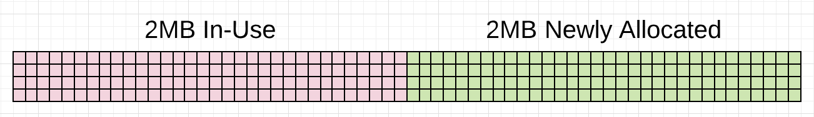
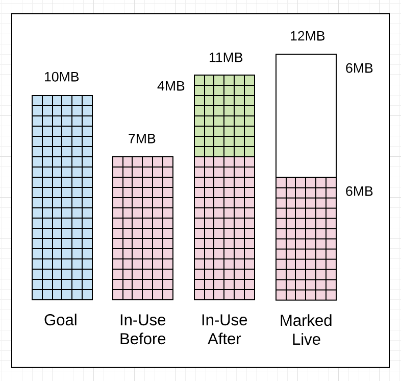
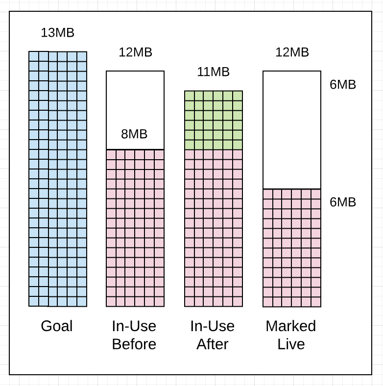
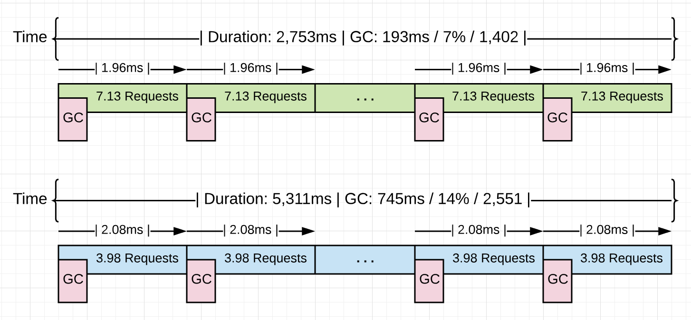
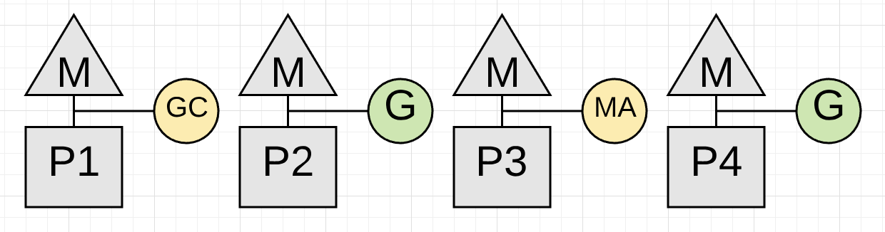

### Garbage Collection In Go : Part I - Semantics

### Prelude

This is the first post in a three part series that will provide an understanding of the mechanics and semantics behind the garbage collector in Go. This post focuses on the foundation material on the collector’s semantics.

Index of the three part series:
\1) [Garbage Collection In Go : Part I - Semantics](https://www.ardanlabs.com/blog/2018/12/garbage-collection-in-go-part1-semantics.html)
\2) [Garbage Collection In Go : Part II - GC Traces](https://www.ardanlabs.com/blog/2019/05/garbage-collection-in-go-part2-gctraces.html)
\2) [Garbage Collection In Go : Part III - GC Pacing](https://www.ardanlabs.com/blog/2019/07/garbage-collection-in-go-part3-gcpacing.html)

### Introduction

Garbage collectors have the responsibility of tracking heap memory allocations, freeing up allocations that are no longer needed, and keeping allocations that are still in-use. How a language decides to implement this behavior is complex but it shouldn’t be a requirement for application developers to understand the details in order to build software. Plus, with different releases of a language’s VM or runtime, the implementation of these systems are always changing and evolving. What’s important for application developers is to maintain a good working model of how the garbage collector for their language behaves and how they can be sympathetic with that behavior without being concerned as to the implementation.

As of version 1.12, the Go programming language uses a non-generational concurrent tri-color mark and sweep collector. If you want to visually see how a mark and sweep collector works, Ken Fox wrote this great [article](https://spin.atomicobject.com/2014/09/03/visualizing-garbage-collection-algorithms) and provides an animation. The implementation of Go’s collector has changed and evolved with every release of Go. So any post that talks about the implementation details will no longer be accurate once the next version of the language is released.

With all that said, the modeling I will do in this post will not focus on the actual implementation details. The modeling will focus on the behavior you will experience and the behavior you should expect to see for years to come. In this post, I will share with you the behavior of the collector and explain how to be sympathetic with that behavior, regardless of the current implementation or how it changes in the future. This will make you a better Go developer.

*Note: Here is more reading you can do about [garbage collectors](https://github.com/ardanlabs/gotraining/tree/master/reading#garbage-collection) and Go’s actual collector as well.*

### The Heap Is Not A Container

I will never refer to the heap as a container that you can store or release values from. It’s important to understand that there is no linear containment of memory that defines the “Heap”. Think that any memory reserved for application use in the process space is available for heap memory allocation. Where any given heap memory allocation is virtually or physically stored is not relevant to our model. This understanding will help you better understand how the garbage collector works.

### Collector Behavior

When a collection starts, the collector runs through three phases of work. Two of these phases create Stop The World (STW) latencies and the other phase creates latencies that slow down the throughput of the application. The three phases are:

- Mark Setup - STW
- Marking - Concurrent
- Mark Termination - STW

Here is a break-down of each phase.

**Mark Setup - STW**

When a collection starts, the first activity that must be performed is turning on the Write Barrier. The purpose of the Write Barrier is to allow the collector to maintain data integrity on the heap during a collection since both the collector and application goroutines will be running concurrently.

In order to turn the Write Barrier on, every application goroutine running must be stopped. This activity is usually very quick, within 10 to 30 microseconds on average. That is, as long as the application goroutines are behaving properly.

*Note: To better understand these scheduler diagrams, be sure to read this series of posts on the [Go Scheduler](https://www.ardanlabs.com/blog/2018/08/scheduling-in-go-part1.html)*

**Figure 1**


Figure 1 shows 4 application goroutines running before the start of a collection. Each of those 4 goroutines must be stopped. The only way to do that is for the collector to watch and wait for each goroutine to make a function call. Function calls guarantee the goroutines are at a safe point to be stopped. What happens if one of those goroutines doesn’t make a function call but the others do?

**Figure 2**


Figure 2 shows a real problem. The collection can’t start until the goroutine running on P4 is stopped and that can’t happen because it’s in a [tight loop](https://github.com/golang/go/issues/10958) performing some math.

**Listing 1**

```
01 func add(numbers []int) int {
02     var v int
03     for _, n := range numbers {
04         v += n
05     }
06     return v
07 }
```

Listing 1 shows the code that the Goroutine running on P4 is executing. Depending on the size of the slice, the Goroutine could run for an unreasonable amount of time with no opportunity to be stopped. This is the kind of code that could stall a collection from starting. What’s worse is the other P’s can’t service any other goroutines while the collector waits. It’s critically important that goroutines make function calls in reasonable timeframes.

*Note: This is something the language team is looking to correct in 1.14 by adding [preemptive](https://github.com/golang/go/issues/24543) techniques to the scheduler.*

**Marking - Concurrent**

Once the Write Barrier is turned on, the collector commences with the Marking phase. The first thing the collector does is take 25% of the available CPU capacity for itself. The collector uses Goroutines to do the collection work and needs the same P’s and M’s the application Goroutines use. This means for our 4 threaded Go program, one entire P will be dedicated to collection work.

**Figure 3**


Figure 3 shows how the collector took P1 for itself during the collection. Now the collector can start the Marking phase. The Marking phase consists of marking values in heap memory that are still in-use. This work starts by inspecting the stacks for all existing goroutines to find root pointers to heap memory. Then the collector must traverse the heap memory graph from those root pointers. While the Marking work is happening on P1, application work can continue concurrently on P2, P3 and P4. This means the impact of the collector has been minimized to 25% of the current CPU capacity.

I wish that was the end of the story but it isn’t. What if it’s identified during the collection that the Goroutine dedicated to GC on P1 will not finish the Marking work before the heap memory in-use reaches its limit? What if only one of those 3 Goroutines performing application work is the reason the collector will not finish in time? In this case, new allocations have to be slowed down and specifically from that Goroutine.

If the collector determines that it needs to slow down allocations, it will recruit the application Goroutines to assist with the Marking work. This is called a Mark Assist. The amount of time any application Goroutine will be placed in a Mark Assist is proportional to the amount of data it’s adding to heap memory. One positive side effect of Mark Assist is that it helps to finish the collection faster.

**Figure 4**


Figure 4 shows how the application Goroutine running on P3 is now performing a Mark Assist and helping with the collection work. Hopefully the other application Goroutines don’t need to get involved as well. Applications that allocate heavy could see the majority of the running Goroutines perform small amounts of Mark Assist during collections.

One goal of the collector is to eliminate the need for Mark Assists. If any given collection ends up requiring a lot of Mark Assist, the collector can start the next garbage collection earlier. This is done in an attempt to reduce the amount of Mark Assist that will be necessary on the next collection.

**Mark Termination - STW**

Once the Marking work is done, the next phase is Mark Termination. This is when the Write Barrier is turned off, various clean up tasks are performed, and the next collection goal is calculated. Goroutines that find themselves in a tight loop during the Marking phase can also cause Mark Termination STW latencies to be extended.

**Figure 5**


Figure 5 shows how all the Goroutines are stopped while the Mark Termination phase completes. This activity is usually within 60 to 90 microseconds on average. This phase could be done without a STW, but by using a STW, the code is simpler and the added complexity is not worth the small gain.

Once the collection is finished, every P can be used by the application Goroutines again and the application is back to full throttle.

**Figure 6**


Figure 6 shows how all of the available P’s are now processing application work again once the collection is finished. The application is back to full throttle as it was before the collection started.

**Sweeping - Concurrent**

There is another activity that happens after a collection is finished called Sweeping. Sweeping is when the memory associated with values in heap memory that were not marked as in-use are reclaimed. This activity occurs when application Goroutines attempt to allocate new values in heap memory. The latency of Sweeping is added to the cost of performing an allocation in heap memory and is not tied to any latencies associated with garbage collection.

The following is a sample of a trace on my machine where I have 12 hardware threads available for executing Goroutines.

**Figure 7**


Figure 7 shows a partial snapshot of the trace. You can see how during this collection (keep your view within the blue GC line at the top), three of the twelve P’s are dedicated to GC. You can see Goroutine 2450, 1978, and 2696 during this time are performing moments of Mark Assist work and not its application work. At the very end of the collection, only one P is dedicated to GC and eventually performs the STW (Mark Termination) work.

After the collection is finished, the application is back to running at full throttle. Except you see a lot of rose colored lines underneath those Goroutines.

**Figure 8**


Figure 8 shows how those rose colored lines represent moments when the Goroutine is performing the Sweeping work and not its application work. These are moments when the Goroutine is attempting to allocate new values in heap memory.

**Figure 9**


Figure 9 shows the end of the stack trace for one of the Goroutines in the Sweep activity. The call to `runtime.mallocgc` is the call to allocate a new value in heap memory. The call to `runtime.(*mcache).nextFree` is causing the Sweep activity. Once there are no more allocations in heap memory to reclaim, the call to `nextFree` won’t be seen any longer.

The collection behavior that was just described only happens when a collection has started and is running. The GC Percentage configuration option plays a big role in determining when a collection starts.

### GC Percentage

There is a configuration option in the runtime called GC Percentage, which is set to 100 by default. This value represents a ratio of how much new heap memory can be allocated before the next collection has to start. Setting the GC Percentage to 100 means, based on the amount of heap memory marked as live after a collection finishes, the next collection has to start at or before 100% more new allocations are added to heap memory.

As an example, imagine a collection finishes with 2MB of heap memory in-use.

*Note: The diagrams of the heap memory in this post do not represent a true profile when using Go. The heap memory in Go will often be fragmented and messy, and you don’t have the clean separation as the images are representing. These diagrams provide a way to visualize heap memory in an easier to understand way that is accurate towards the behavior you will experience.*

**Figure 10**


Figure 10 shows the 2MB of heap memory in-use after the last collection finished. Since the GC Percentage is set to 100%, the next collection needs to start at or before 2 more MB of heap memory is added.

**Figure 11**


Figure 11 shows that 2 more MB of heap memory is now in-use. This will trigger a collection. A way to view all of this in action, is to generate a GC trace for every collection that takes place.

### GC Trace

A GC trace can be generated by including the environmental variable `GODEBUG` with the `gctrace=1` option when running any Go application. Every time a collection happens, the runtime will write the GC trace information to `stderr`.

**Listing 2**

```
GODEBUG=gctrace=1 ./app

gc 1405 @6.068s 11%: 0.058+1.2+0.083 ms clock, 0.70+2.5/1.5/0+0.99 ms cpu, 7->11->6 MB, 10 MB goal, 12 P

gc 1406 @6.070s 11%: 0.051+1.8+0.076 ms clock, 0.61+2.0/2.5/0+0.91 ms cpu, 8->11->6 MB, 13 MB goal, 12 P

gc 1407 @6.073s 11%: 0.052+1.8+0.20 ms clock, 0.62+1.5/2.2/0+2.4 ms cpu, 8->14->8 MB, 13 MB goal, 12 P
```

Listing 2 shows how to use the `GODEBUG` variable to generate GC traces. The listing also shows 3 traces that were generated by the running Go application.

Here is a break-down of what each value in the GC trace means by reviewing the first GC trace line in the listing.

**Listing 3**

```
gc 1405 @6.068s 11%: 0.058+1.2+0.083 ms clock, 0.70+2.5/1.5/0+0.99 ms cpu, 7->11->6 MB, 10 MB goal, 12 P

// General
gc 1404     : The 1404 GC run since the program started
@6.068s     : Six seconds since the program started
11%         : Eleven percent of the available CPU so far has been spent in GC

// Wall-Clock
0.058ms     : STW        : Mark Start       - Write Barrier on
1.2ms       : Concurrent : Marking
0.083ms     : STW        : Mark Termination - Write Barrier off and clean up

// CPU Time
0.70ms      : STW        : Mark Start
2.5ms       : Concurrent : Mark - Assist Time (GC performed in line with allocation)
1.5ms       : Concurrent : Mark - Background GC time
0ms         : Concurrent : Mark - Idle GC time
0.99ms      : STW        : Mark Term

// Memory
7MB         : Heap memory in-use before the Marking started
11MB        : Heap memory in-use after the Marking finished
6MB         : Heap memory marked as live after the Marking finished
10MB        : Collection goal for heap memory in-use after Marking finished

// Threads
12P         : Number of logical processors or threads used to run Goroutines
```

Listing 3 shows the actual numbers from the first GC trace line broken down by what the values mean. I will eventually talk about most of these values, but for now just focus on the memory section of the GC trace for trace 1405.

**Figure 12**


**Listing 4**

```
// Memory
7MB         : Heap memory in-use before the Marking started
11MB        : Heap memory in-use after the Marking finished
6MB         : Heap memory marked as live after the Marking finished
10MB        : Collection goal for heap memory in-use after Marking finished
```

What this GC trace line is telling you in listing 4, is that the amount of heap memory in-use was 7MB before the Marking work started. When the Marking work finished, the amount of heap memory in-use reached 11MB. Which means there was an additional 4MB of allocations that occurred during the collection. The amount of heap memory that was marked as live after the Marking work finished was 6MB. This means the application can increase the amount of heap memory in-use to 12MB (100% of the live heap size of 6MB) before the next collection needs to start.

You can see that the collector missed its goal by 1MB. The amount of heap memory in-use after the Marking work finished was 11MB not 10MB. That’s ok, because the goal is calculated based on the current amount of the heap memory in-use, the amount of heap memory marked as live, and timing calculations about the additional allocations that will occur while the collection is running. In this case, the application did something that required more heap memory to be in-use after Marking than expected.

If you look at the next GC trace line (1406), you will see how things changed within 2ms.

**Figure 13**


**Listing 5**

```
gc 1406 @6.070s 11%: 0.051+1.8+0.076 ms clock, 0.61+2.0/2.5/0+0.91 ms cpu, 8->11->6 MB, 13 MB goal, 12 P

// Memory
8MB         : Heap memory in-use before the Marking started
11MB        : Heap memory in-use after the Marking finished
6MB         : Heap memory marked as live after the Marking finished
13MB        : Collection goal for heap memory in-use after Marking finished
```

Listing 5 shows how this collection started 2ms after the start of the previous collection (6.068s vs 6.070s) even though the heap memory in-use had only reached 8MB of the 12MB that was allowed. It’s important to note, if the collector decides it’s better to start a collection earlier it will. In this case, it probably started earlier because the application is allocating heavily and the collector wanted to reduce the amount of Mark Assist latency during this collection.

Two more things of note. The collector stayed within its goal this time. The amount of heap memory in-use after Marking finished was 11MB not 13MB, 2 MB less. The amount of heap memory marked as live after Marking finished was the same at 6MB.

As a side note. You can get more details from the GC trace by adding the `gcpacertrace=1` flag. This causes the collector to print information about the internal state of the concurrent pacer.

**Listing 6**

```
$ export GODEBUG=gctrace=1,gcpacertrace=1 ./app

Sample output:
gc 5 @0.071s 0%: 0.018+0.46+0.071 ms clock, 0.14+0/0.38/0.14+0.56 ms cpu, 29->29->29 MB, 30 MB goal, 8 P

pacer: sweep done at heap size 29MB; allocated 0MB of spans; swept 3752 pages at +6.183550e-004 pages/byte

pacer: assist ratio=+1.232155e+000 (scan 1 MB in 70->71 MB) workers=2+0

pacer: H_m_prev=30488736 h_t=+2.334071e-001 H_T=37605024 h_a=+1.409842e+000 H_a=73473040 h_g=+1.000000e+000 H_g=60977472 u_a=+2.500000e-001 u_g=+2.500000e-001 W_a=308200 goalΔ=+7.665929e-001 actualΔ=+1.176435e+000 u_a/u_g=+1.000000e+000
```

Running a GC trace can tell you a lot about the health of the application and the pace of the collector. The pace at which the collector is running plays an important role in collection process.

### Pacing

The collector has a pacing algorithm which is used to determine when a collection is to start. The algorithm depends on a feedback loop that the collector uses to gather information about the running application and the stress the application is putting on the heap. Stress can be defined as how fast the application is allocating heap memory within a given amount of time. It’s that stress that determines the pace at which the collector needs to run.

Before the collector starts a collection, it calculates the amount of time it believes it will take to finish the collection. Then once a collection is running, latencies will be inflicted on the running application that will slow down application work. Every collection adds to the overall latency of the application.

One misconception is thinking that slowing down the pace of the collector is a way to improve performance. The idea being, if you can delay the start of the next collection, then you are delaying the latency it will inflict. Being sympathetic with the collector isn’t about slowing down the pace.

You could decide to change the GC Percentage value to something larger than 100. This will increase the amount of heap memory that can be allocated before the next collection has to start. This could result in the pace of collection to slow down. Don’t consider doing this.

**Figure 14**


Figure 14 shows how changing the GC Percentage would change the amount of heap memory allowed to be allocated before the next collection has to start. You can visualize how the collector could be slowed down as it waits for more heap memory to become in-use.

Attempting to directly affect the pace of collection has nothing to do with being sympathetic with the collector. It’s really about getting more work done between each collection or during the collection. You affect that by reducing the amount or the number of allocations any piece of work is adding to heap memory.

*Note: The idea is also to achieve the throughput you need with the smallest heap possible. Remember, minimizing the use of resources like heap memory is important when running in cloud environments.*

**Figure 15**


Listing 15 shows some statistics of a running Go application that will be used in the next part of this series. The version in blue shows stats for the application without any optimizations when 10k requests are processed through the application. The version in green shows stats after 4.48GB of non-productive memory allocations were found and removed from the application for the same 10k requests.

Look at the average pace of collection for both versions (2.08ms vs 1.96ms). They are virtually the same, at around ~2.0ms. What fundamentally changed between these two versions is the amount of work that is getting done between each collection. The application went from processing 3.98 to 7.13 requests per collection. That is a 79.1% increase in the amount of work getting done at the same pace. As you can see, the collection did not slow down with the reduction of those allocations, but remained the same. The win came from getting more work done in-between each collection.

Adjusting the pace of the collection to delay the latency cost is not how you improve the performance of your application. It’s about reducing the amount of time the collector needs to run, which in turn will reduce the amount of latency cost being inflicted. The latency costs inflicted by the collector has been explained, but let me summarize it again for clarity.

### Collector Latency Costs

There are two types of latencies every collection inflicts on your running application. The first is the stealing of CPU capacity. The effect of this stolen CPU capacity means your application is not running at full throttle during the collection. The application Goroutines are now sharing P’s with the collector’s Goroutines or helping with the collection (Mark Assist).

**Figure 16**


Figure 16 shows how the application is only using 75% of its CPU capacity for application work. This is because the collector has dedicated P1 for itself. This is going to be for the majority of the collection.

**Figure 17**


Figure 17 shows how the application in this moment of time (typically just for just a few microseconds) is now only using half of its CPU capacity for application work. This is because the goroutine on P3 is performing a Mark Assist and the collector has dedicated P1 for itself.

*Note: Marking usually takes 4 CPU-milliseconds per MB of live heap (e.g., to estimate how many milliseconds the Marking phase will run for, take the live heap size in MB and divide by 0.25 \* the number of CPUs). Marking actually runs at about 1 MB/ms, but only has a quarter of the CPUs.*

The second latency that is inflicted is the amount of STW latency that occurs during the collection. The STW time is when no application Goroutines are performing any of their application work. The application is essentially stopped.

**Figure 18**


Figure 18 is showing STW latency where all the Goroutines are stopped. This happens twice on every collection. If your application is healthy, the collector should be able to keep the total STW time at or below 100 microsecond for the majority of collections.

You now know the different phases of the collector, how memory is sized, how pacing works, and the different latencies the collector inflicts on your running application. With all that knowledge, the question of how you can be sympathetic with the collector can finally be answered.

### Being Sympathetic

Being sympathetic with the collector is about reducing stress on heap memory. Remember, stress can be defined as how fast the application is allocating heap memory within a given amount of time. When stress is reduced, the latencies being inflicted by the collector will be reduced. It’s the GC latencies that are slowing down your application.

The way to reduce GC latencies is by identifying and removing unnecessary allocations from your application. Doing this will help the collector in several ways.

Helps the collector:

- Maintain the smallest heap possible.
- Find an optimal consistent pace.
- Stay within the goal for every collection.
- Minimize the duration of every collection, STW and Mark Assist.

All these things help reduce the amount of latency the collector will inflict on your running application. That will increase the performance and throughput of your application. The pace of the collection has nothing to do with it. These are other things you can do as well to help make better engineering decisions that will reduce stress on the heap.

**Understand the nature of the workload your application is performing**
Understanding your workload means making sure you are using a reasonable number of goroutines to get the work you have done. CPU vs IO bound workloads are different and require different engineering decisions.

https://www.ardanlabs.com/blog/2018/12/scheduling-in-go-part3.html

**Understand the data that is defined and how it’s passed around the application**
Understanding your data means knowing the problem you are trying to solve. Data semantic consistency is a critical part of maintaining data integrity and allows you to know (by reading the code) when you are choosing heap allocations over your stack.

https://www.ardanlabs.com/blog/2017/06/design-philosophy-on-data-and-semantics.html

### Conclusion

If you take the time to focus on reducing allocations, you are doing what you can as a Go developer to be sympathetic with the garbage collector. You are not going to write zero allocation applications so it’s important to recognize the difference between allocations that are productive (those helping the application) and those that are not productive (those hurting the application). Then put your faith and trust in the garbage collector to keep the heap healthy and your application running consistently.

Having a garbage collector is a nice tradeoff. I will take the cost of garbage collection so I don’t have the burden of memory management. Go is about allowing you as a developer to be productive while still writing applications that are fast enough. The garbage collector is a big part of making that a reality. In the next post, I will show you a sample web application and how to use the tooling to see all of this in action.