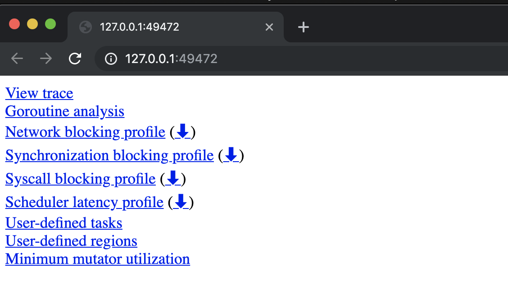

### Garbage Collection In Go : Part III - GC Pacing

### Prelude

This is the third post in a three part series that will provide an understanding of the mechanics and semantics behind the garbage collector in Go. This post focuses on how the GC paces itself.

Index of the three part series:
\1) [Garbage Collection In Go : Part I - Semantics](https://www.ardanlabs.com/blog/2018/12/garbage-collection-in-go-part1-semantics.html)
\2) [Garbage Collection In Go : Part II - GC Traces](https://www.ardanlabs.com/blog/2019/05/garbage-collection-in-go-part2-gctraces.html)
\2) [Garbage Collection In Go : Part III - GC Pacing](https://www.ardanlabs.com/blog/2019/07/garbage-collection-in-go-part3-gcpacing.html)

### Introduction

In the second post, I showed you the behavior of the garbage collector and how to use the tooling to see the latencies that the collector inflicts on your running application. I walked you through running a real web application and showed you how to generate GC traces and application profiles. Then I showed you how to interpret the output from these tools so you can find ways to improve the performance of your applications.

The final conclusion of that post was the same as the first: if you reduce stress on the heap you will reduce the latency costs and therefore increase the application’s performance. The best strategy for being sympathetic with the garbage collector is to reduce the number or the amount of allocation per work being performed. In this post, I will show how the pacing algorithm is capable of identifying the optimal pace for a given workload over time.

### Concurrent Example Code

I am going to use the code located at this link.

https://github.com/ardanlabs/gotraining/tree/master/topics/go/profiling/trace

This program identifies the frequency at which a particular topic can be found in a collection of RSS news feed documents. The trace program contains different versions of a find algorithm to test different concurrency patterns. I will concentrate on the `freq`, `freqConcurrent` and `freqNumCPU` versions of the algorithms.

*Note: I am running the code on a Macbook Pro with an Intel i9 processor with 12 hardware threads using go1.12.7. You will see different results on different architectures, operating systems and versions of Go. The core results of the post should remain the same.*

I will start with the `freq` version first. It represents a non-concurrent sequential version of the program. This will provide a baseline for the concurrent versions that follow.

**Listing 1**

```
01 func freq(topic string, docs []string) int {
02     var found int
03
04     for _, doc := range docs {
05         file := fmt.Sprintf("%s.xml", doc[:8])
06         f, err := os.OpenFile(file, os.O_RDONLY, 0)
07         if err != nil {
08             log.Printf("Opening Document [%s] : ERROR : %v", doc, err)
09             return 0
10         }
11         defer f.Close()
12
13         data, err := ioutil.ReadAll(f)
14         if err != nil {
15             log.Printf("Reading Document [%s] : ERROR : %v", doc, err)
16             return 0
17         }
18
19         var d document
20         if err := xml.Unmarshal(data, &d); err != nil {
21             log.Printf("Decoding Document [%s] : ERROR : %v", doc, err)
22             return 0
23         }
24
25         for _, item := range d.Channel.Items {
26             if strings.Contains(item.Title, topic) {
27                 found++
28                 continue
29             }
30
31             if strings.Contains(item.Description, topic) {
32                 found++
33             }
34        }
35     }
36
37     return found
38 }
```

Listing 1 shows the `freq` function. This sequential version ranges over the collection of file names and performs four actions: open, read, decode and search. It does this for each file, one at a time.

When I run this version of `freq` on my machine, I get the following results.

**Listing 2**

```
$ time ./trace
2019/07/02 13:40:49 Searching 4000 files, found president 28000 times.
./trace  2.54s user 0.12s system 105% cpu 2.512 total
```

You can see by the output of time, the program is taking ~2.5 seconds to process the 4000 files. It would be nice to see what percent of time was spent in garbage collection. You can do that by seeing a trace of the program. Since this is a program that starts and completes, you can use the trace package to generate a trace.

**Listing 3**

```
03 import "runtime/trace"
04
05 func main() {
06     trace.Start(os.Stdout)
07     defer trace.Stop()
```

Listing 3 shows the code you need to generate a trace from your program. After importing the `trace` package from the `runtime` folder in the standard library, make calls to `trace.Start` and `trace.Stop`. Directing the trace output to `os.Stdout` just simplies the code.

With this code in place, now you can rebuild and run the program again. Don’t forget to redirect `stdout` to a file.

**Listing 4**

```
$ go build
$ time ./trace > t.out
Searching 4000 files, found president 28000 times.
./trace > t.out  2.67s user 0.13s system 106% cpu 2.626 total
```

A little over 100 milliseconds was added to the runtime but that is expected. The trace captured every function call, in and out, down to the microsecond. What’s important is that now there is a file named `t.out` that contains the trace data.

To look at the trace, the trace data needs to be run through the tracing tool.

**Listing 5**

```
$ go tool trace t.out
```

Running that command launches the Chrome browser with the following screen.

*Note: The trace tooling is using tooling built into the Chrome browser. This tool only works in Chrome.*

**Figure 1**


Figure 1 shows the 9 links presented when the tracing tool launches. The important link right now is the first link that says `View trace`. Once you select that link, you will see something similar to the following.

**Figure 2**


Figure 2 shows the full trace window from running the program on my machine. For this post, I will focus on the parts that are associated with the garbage collector. That is the second section labeled `Heap` and the fourth section labeled `GC`.

**Figure 3**


Figure 3 shows a closer look at the first 200 milliseconds of the trace. Focus your attention on the `Heap` (green and orange area) and the `GC` (blue lines at the bottom). The `Heap` section is showing you two things. The orange area is the current in-use space on the heap at any given microsecond. The green is the amount of in-use space on the heap that will trigger the next collection. This is why every time the orange area reaches the top of the green area, a garbage collection takes place. The blue lines represent a garbage collection.

In this version of the program, the memory in-use on the heap stays at ~4 meg for the entire run of the program. To see stats about all the individual garbage collections that took place, use the selection tool and draw a box around all the blue lines.

**Figure 4**


Figure 4 shows how a blue box was drawn around the blue lines using the arrow tool. You want to draw the box around every line. The number inside the box represents the amount of time the items selected from the graph consume. In this case, close to 316 milliseconds (ms, μs, ns) were selected to generate this image. When all the blue lines are selected, the following stats are provided.

**Figure 5**


Figure 5 shows that all the blue lines in the graph are between the 15.911 millisecond mark through the 2.596 second mark. There were 232 garbage collections that represented 64.524 milliseconds of time with the average collection taking 287.121 microseconds. Knowing the program took 2.626 seconds to run, this means that garbage collection only constitutes ~2% of the total run time. Essentially the garbage collector was an insignificant cost to running this program.

With a baseline to work from, a concurrent algorithm can be used to perform the same work in the hope to speed up the program.

**Listing 6**

```
01 func freqConcurrent(topic string, docs []string) int {
02     var found int32
03
04     g := len(docs)
05     var wg sync.WaitGroup
06     wg.Add(g)
07
08     for _, doc := range docs {
09         go func(doc string) {
10             var lFound int32
11             defer func() {
12                 atomic.AddInt32(&found, lFound)
13                 wg.Done()
14             }()
15
16             file := fmt.Sprintf("%s.xml", doc[:8])
17             f, err := os.OpenFile(file, os.O_RDONLY, 0)
18             if err != nil {
19                 log.Printf("Opening Document [%s] : ERROR : %v", doc, err)
20                 return
21             }
22             defer f.Close()
23
24             data, err := ioutil.ReadAll(f)
25             if err != nil {
26                 log.Printf("Reading Document [%s] : ERROR : %v", doc, err)
27                 return
28             }
29
30             var d document
31             if err := xml.Unmarshal(data, &d); err != nil {
32                 log.Printf("Decoding Document [%s] : ERROR : %v", doc, err)
33                 return
34             }
35
36             for _, item := range d.Channel.Items {
37                 if strings.Contains(item.Title, topic) {
38                     lFound++
39                     continue
40                 }
41
42                 if strings.Contains(item.Description, topic) {
43                     lFound++
44                 }
45             }
46         }(doc)
47     }
48
49     wg.Wait()
50     return int(found)
51 }
```

Listing 6 shows one possible concurrent version of `freq`. The core design patterns for this version is to use a fan out pattern. For every file listed in the `docs` collection, a goroutine is created to process that file. If there are 4000 documents to process, then 4000 goroutines are used. The advantage of this algorithm is that it’s the simplest way to leverage concurrency. Each goroutine processes 1 and only 1 file. The orchestration of waiting for every document to be processed can be performed using a `WaitGroup` and an atomic instruction can keep the counter synchronized.

The disadvantage of this algorithm is that it doesn’t scale well with the number of documents or cores. All the goroutines will be given time to run very early on in the start of the program, which means a large amount of memory will be consumed quickly. There are also cache coherency problems with the adding of the `found` variable on line 12. This is going to cause the thrashing of memory due to each core sharing the same cache line for this variable. This gets worse as the number of files or cores increase.

With this code in place, now you can rebuild and run the program again.

**Listing 7**

```
$ go build
$ time ./trace > t.out
Searching 4000 files, found president 28000 times.
./trace > t.out  6.49s user 2.46s system 941% cpu 0.951 total
```

You can see by the output in listing 7, the program is now taking 951 milliseconds to process the same 4000 files. That is a ~64% percent improvement in performance. Take a look at the trace.

**Figure 6**


Figure 6 shows how much more of the CPU capacity on my machine is being used by this version of the program. There is a lot of density in the beginning of the graph. This is because as all the goroutines get created, they run and begin to attempt to allocate memory in the heap. As soon as the first 4 meg of memory is allocated, which is very quickly, a GC starts. During this GC, each Goroutine gets time to run and most get placed into a waiting state when they request memory on the heap. At least 9 goroutines get to continue to run and grow the heap to ~26 meg by the time this GC is complete.

**Figure 7**


Figure 7 shows how large amounts of goroutines are in Runnable and Running states for a large portion of the first GC and how that starts up again quickly. Notice the heap profile looks irregular and collections are not on any regular cadence as before. If you look closely, a second GC starts almost immediately after the first.

If you select all the collections in this graph you will see the following.

**Figure 8**


Figure 8 shows that all the blue lines in the graph are between the 4.828 millisecond mark through the 906.939 millisecond mark. There were 23 garbage collections that represented 284.447 milliseconds of time with the average collection taking 12.367 milliseconds. Knowing the program took 951 milliseconds to run, this means that garbage collection constituted ~34% of the total run time.

This is a significant difference in both performance and GC time from the sequential version. However, running more goroutines in parallel the way it was done, allowed the work to get done ~64% faster. The cost was needing a lot more resources on the machine. Unfortunate at its peak, ~200 meg of memory was in-use at one time on the heap.

With a concurrent baseline to work from, the next concurrent algorithm tries to be more efficient with resources.

**Listing 8**

```
01 func freqNumCPU(topic string, docs []string) int {
02     var found int32
03
04     g := runtime.NumCPU()
05     var wg sync.WaitGroup
06     wg.Add(g)
07
08     ch := make(chan string, g)
09
10     for i := 0; i < g; i++ {
11         go func() {
12             var lFound int32
13             defer func() {
14                 atomic.AddInt32(&found, lFound)
15                 wg.Done()
16             }()
17
18             for doc := range ch {
19                 file := fmt.Sprintf("%s.xml", doc[:8])
20                 f, err := os.OpenFile(file, os.O_RDONLY, 0)
21                 if err != nil {
22                     log.Printf("Opening Document [%s] : ERROR : %v", doc, err)
23                     return
24                 }
25
26                 data, err := ioutil.ReadAll(f)
27                 if err != nil {
28                     f.Close()
29                     log.Printf("Reading Document [%s] : ERROR : %v", doc, err)
23                     return
24                 }
25                 f.Close()
26
27                 var d document
28                 if err := xml.Unmarshal(data, &d); err != nil {
29                     log.Printf("Decoding Document [%s] : ERROR : %v", doc, err)
30                     return
31                 }
32
33                 for _, item := range d.Channel.Items {
34                     if strings.Contains(item.Title, topic) {
35                         lFound++
36                         continue
37                     }
38
39                     if strings.Contains(item.Description, topic) {
40                         lFound++
41                     }
42                 }
43             }
44         }()
45     }
46
47     for _, doc := range docs {
48         ch <- doc
49     }
50     close(ch)
51
52     wg.Wait()
53     return int(found)
54 }
```

Listing 8 shows the `freqNumCPU` version of the program. The core design patterns for this version is to use a pooling pattern. A pool of goroutines based on the number of logical processors to process all the files. If there are 12 logical processors available for use, then 12 goroutines are used. The advantage of this algorithm is that it keeps the resource usage of the program consistent from beginning to end. Since a fixed number of goroutines are used, only the memory those 12 goroutines need at any given time is required. This also fixes the cache coherency problem with the memory thrashing. This is because the call to the atomic instruction on line 14 only has to happen a small fixed number of times.

The disadvantage of this algorithm is more complexity. It adds the use of a channel to feed the pool of goroutines all the work. Any time pooling is being used, identifying the “correct” number of goroutines for the pool is complicated. As a general rule, I give the pool 1 goroutine per logical processor to start. Then performing load testing or using production metrics, a final value for the pool can be calculated.

With this code in place, now you can rebuild and run the program again.

**Listing 9**

```
$ go build
$ time ./trace > t.out
Searching 4000 files, found president 28000 times.
./trace > t.out  6.22s user 0.64s system 909% cpu 0.754 total
```

You can see by the output in listing 9, the program is now taking 754 millisecond to process the same 4000 files. The program is ~200 milliseconds faster which is significant for this small load. Take a look at the trace.

**Figure 9**


Figure 9 shows how all of the CPU capacity on my machine is being used by this version of the program as well. If you look closely there is a consistent cadance to the program again. Very similar to the sequential version.

**Figure 10**


Figure 10 shows how a closer view of the core metrics for the first 20 milliseconds of the program. The collections are definitely longer than the sequential version but there are 12 goroutines running. The memory in-use on the heap stays at ~4 meg for the entire run of the program. Again, the same as the sequential version of the program.

If you select all the collections in this graph you will see the following.

**Figure 11**


Figure 11 shows that all the blue lines in the graph are between the 3.055 millisecond mark through the 719.928 millisecond mark. There were 467 garbage collections that represented 177.709 milliseconds of time with the average collection taking 380.535 microseconds. Knowing the program took 754 milliseconds to run, this means that garbage collection constituted ~25% of the total run time. A 9% improvement over the other concurrent version.

This version of the concurrent algorithm appears that it will scale better with more files and cores. The complexity cost in my opinion is worth the benefis. The channel could be replaced with slicing the list into a bucket of work for each Goroutine. This will definitely add more complexity though it could reduce some of the latency cost incurred by the channel. Over more files and cores, this could potentially be significant, but the complexity cost needs to be measured. This is something you can try yourself.

### Conclusion

What I love about comparing the three versions of the algorithm is how the GC handled each situation. The total amount of memory required to process the files doesn’t change across any version. What changes is how the program allocates.

When there is only one goroutine, a base 4 meg heap is all that is needed. When the program threw all the work at the runtime at once, the GC took the approach of letting the heap grow, reducing the number of collections but running longer collections. When the program controlled the number of files being worked on at any given time, the GC took the approach of keeping the heap small again, increasing the number of collections but running smaller collections. Each approach the GC took essentially allowed the programs to run with the minimal impact the GC could have on the program.

```
| Algorithm  | Program | GC Time  | % Of GC | # of GC’s | Avg GC   | Max Heap |
|------------|---------|----------|---------|-----------|----------|----------|
| freq       | 2626 ms |  64.5 ms |     ~2% |       232 |   278 μs |    4 meg |
| concurrent |  951 ms | 284.4 ms |    ~34% |        23 |  12.3 ms |  200 meg |
| numCPU     |  754 ms | 177.7 ms |    ~25% |       467 | 380.5 μs |    4 meg |
```

The `freqNumCPU` version has other things going for it like dealing with cache coherency better, which is helping. However, the difference in the total amount of GC time for each program is fairly close, ~284.4 ms vs ~177.7 ms. On some days running this program on my machine, those numbers are even closer. Running some experiments using version 1.13.beta1, I’ve seen both algorithms run at an equal time. Potentially suggesting their may be some improvements coming that allow the GC to better predict how to run.

All of this gives me the confidence to throw a lot of work at the runtime. Such is a web service using 50k goroutines, which is essentially a fan out pattern similar to the first concurrent algorithm. The GC will study the workload and find the optimal pace for the service to get out of its way. At least for me, not having to think about any of this is worth the price of admission.