[TOC]

# 高可用

## 含义

>   它通常是指，通过设计减少系统不能提供服务的时间

1.  方法论上，高可用保证的原则是“集群化”
2.  保证系统高可用，架构设计的核心准则是：冗余
3.  通过.“自动故障转移”来实现系统的高可用

## 分层架构

常见互联网分布式架构如上，分为：

1.  客户端层：典型调用方是浏览器browser或者手机应用APP

2.  反向代理层：系统入口，反向代理

3.  站点应用层：实现核心应用逻辑，返回html或者json

4.  服务层：如果实现了服务化，就有这一层

5.  数据-缓存层：缓存加速访问存储

6.  数据-数据库层：数据库固化数据存储

整个系统的高可用，又是通过每一层的冗余+自动故障转移来综合实现的

## 客户端-反向代理

一台对线上提供服务，另一台冗余以保证高可用，常见的实践是keepalived存活探测，相同virtual IP提供服务。

## 反向代理-站点层

当web-server挂了的时候，nginx能够探测到，会自动的进行故障转移，将流量自动迁移到其他的web-server，整个过程由nginx自动完成，对调用方是透明的

## 站点-服务层

“服务连接池”会建立与下游服务多个连接，每次请求会“随机”选取连接来访问下游服务。

## 服务层-缓存

### 双读双写

### 主从集群

### 反高可用

允许cache miss

## 服务层-数据库

### 主从-读

当读库挂了的时候，db-connection-pool能够探测到，会自动的进行故障转移，将流量自动迁移到其他的读库，整个过程由连接池自动完成，对调用方是透明的

### 主从-写

可以设置两个mysql双主同步，一台对线上提供服务，另一台冗余以保证高可用，常见的实践是keepalived存活探测，相同virtual IP提供服务

