[TOC]

### Web安全

#### CORS

跨域资源访问

##### 同源策略

同协议，同域名，同端口

注意是浏览器具有的同源策略的限制. 同源策略是一种浏览器的安全机制

限制内容

- [x] Cookie，限制不同源读取他源的Cookie
- [x] DOM节点
- [x] Ajax，限制渲染从他源获取的数据

##### 跨域

协议，域名，端口任何一个不同都是跨域

浏览器会对响应数据检测是否是同源的，不同源不予显示。也就是说请求正常的发送出去，结果也是正常的响应，但是数据被浏览器拦截了。阻止跨域就是为了阻止用户读取另一个域名下的数据.

##### CORS

CORS需要浏览器和服务器同时支持。目前，所有浏览器都支持该功能，IE浏览器不能低于IE10。整个CORS通信过程，都是浏览器自动完成，不需要用户参与。对于开发者来说，CORS通信与同源的AJAX通信没有差别，代码完全一样。浏览器一旦发现AJAX请求跨源，就会自动添加一些附加的头信息，还会多出一次附加的请求，但用户不会有感觉

因此，实现CORS通信的关键是服务器，只要服务器实现了CORS接口，就可以跨源通信

本质上设置响应头

~~~bash
Access-Control-Allow-Origin = "*"
Access-Control-Allow-Methods = "POST, PUT, DELETE"
Access-Control-Allow-Headers = "Content-Type"
~~~

自己定义中间件设置响应头

1. 简单请求

    * GET/HEAD/POST
    * Content-Type: text/plain;  (multipart/form-data /  application/x-www-form-urlencoded )

2. 复杂请求

    不符合以上条件的就是复杂请求，比如前端类型 application/json 就是复杂请求，在正式通信之前会增加一次options HTTP请求，称为预检，请求方法为options，通过该请求来询问服务端是否允许跨域请求

#### CSXF

#### SQL注入

