[TOC]

## 基础架构：一条SQL查询语句是如何执行的？

> 看待一件事，先鸟瞰全貌，从高纬度理解问题，再深入局部

MySQL: My Ess Que Ell

~~~mysql
mysql> select * from T where ID=10；
~~~

### MySQL架构示意图

1.  图示

#### Server

>   MySQL功能层

1.  连接器、查询缓存、分析器、优化器、执行器
2.  涵盖大部分的MySQL功能，以及内置函数
3.  跨存储引擎功能：存储过程、视图、触发器

#### 存储引擎

>   负责存储

1.  负责数据的存储和提取
2.  MySQL5.5.5版本以后默认使用InnoDB

### 1 连接器

基本认识

1.  建立连接[TCP]

~~~bash
msyql -u $user -h $host -P $port -p
~~~

2.  获取权限

    >   连接器去权限表中查询你拥有的权限，一旦通过权限就会保存在该连接中

~~~mysql
mysql> show processlist;
~~~

3.  维持和管理连接

    *   客户端如果一直处于静默状态，MySQL默认是8小时后就会断开【wait_timeout控制】
    *   客户端如果持续请求，那么就会使用同一个连接，也就是建立了长连接
    *   如果查询几次就断开，那么称为短连接
    *   建立连接的过程很复杂，建议使用长连接

长连接

1.  全部都是长连接,MySQL内存涨的很快，因为MySQL在执行过程中临时使用的内存是在连接里面的
2.  需要断开才会释放内存，长期积累就会造成内存占用太大，被系统杀死，造成MySQL重启
3.  解决办法
    *   定期断开长连接
    *   5.7版本以上, 可以在执行一次大的操作后,通过执行mysql_reset_connection来做初始化连接资源
    *   这个过程不需要重连和重新做权限验证，但是会将连接恢复到刚刚创建完时的状态

### 2 查询缓存

连接建立完成，执行逻辑来到第二步：查询缓存

1.  MySQL拿到一个请求，就会去查询缓存 Key-Value模式
2.  Key代表SQL语句、Value是查询的值
3.  如果查询缓存成功就会直接返回，效率非常高
4.  大多数情况下不建议使用查询缓存，只要表有更新，那么缓存就会失效，所以很难命中
5.  可以指定参数query_cache_type设置成DEMAND，所有的查询语句不适用查询缓存
6.  单独语句使用

~~~mysql
mysql> select SQL_CACHE * from T where ID = 10;
~~~

7.  MySQL8.0废弃了查询缓存

### 3 分析器

1.  语义检查：分析SQL语句的关键字、分析出SQL中的列是否存在表中
2.  语法检查：分析整体SQL语句的MySQL语法正确性

### 4 优化器

1.  确定使用哪个索引【怎么选择索引】、确定连表的顺序等
2.  将分析器生成的解析树转换成执行计划，评估最后确定真正的执行方案

### 5 执行器

1.  开始执行语句
2.  判断是否对这个表有操作权限，有则通过
3.  打开表，执行器拿着SQL语句通过表引擎的定义去调用接口