[TOC]

# 负载均衡

>   将请求/数据【均匀】分摊到多个操作单元上执行，负载均衡的关键在于【均匀】

## 纵览

需要做到每一个上游都均匀访问每一个下游，就能实现“将请求/数据【均匀】分摊到多个操作单元上执行

## 客户端-反向代理

通过一个域名可以解析多个IP地址，通过DNS轮询的方式可以返回这些ip，保证每个ip的解析概率是相同的。这些ip就是nginx的外网ip，以做到每台nginx的请求分配也是均衡的

## 反向代理-站点

通过nginx配置将请求分发到具体的服务器，也有多种方式的实现

1.  请求轮询：和DNS轮询类似，请求依次路由到各个web-server

2.  最少连接路由：哪个web-server的连接少，路由到哪个web-server

3.  ip哈希：按照访问用户的ip哈希值来路由web-server，只要用户的ip分布是均匀的

## 站点-服务层

站点层到服务层的负载均衡，是通过“服务连接池”实现的.上游连接池会建立与下游服务多个连接，每次请求会“随机”选取连接来访问下游服务

## 数据层

### range

每一个数据服务，存储一定范围的数据

1.  规则简单，service只需判断一下uid范围就能路由到对应的存储服务

2.  数据均衡性较好

3.  比较容易扩展，可以随时加一个uid[2kw,3kw]的数据服务

4.  请求的负载不一定均衡，一般来说，新注册的用户会比老用户更活跃，大range的服务请求压力会更大

### hash

1.  规则简单，service只需对uid进行hash能路由到对应的存储服务

2.  数据均衡性较好

3.  请求均匀性较好

4.  不容易扩展，扩展一个数据服务，hash方法改变时候，可能需要进行数据迁移

