[TOC]

### RabbitMQ

#### 消息可靠性(防止消息丢失)

Sender -> Server

comfirm模式

总的来说需要开启[Queue]队列持久化、消息持久化、发布确认机制, 才能保证消息发送到MQ

#### 避免重复消费

Queue-> Receiver

Ack or Nack

解决思路是: 保证消息的唯一性, 避免重复投递; 保证消息的幂等性, 避免重复消费;

1. 在消息生产时, MQ内部针对每条生产者发送的消息生成一个inner-msg-id, 作为去重和幂等的依据(消息投递失败并重传), 避免重复的消息进入队列; [MQ生成, 对生产与消费屏蔽]
2. 在消息消费时, 要求消息体中必须要有一个bizId(对于同一业务全局唯一, 如订单ID), 作为去重和幂等的依据, 避免同一条消息被重复消费. (例如Redis存储ID, 查询是否被消费) [业务相关]