### NetWork

#### Service NetWork

#### Service

A/AAAA

Cluster IP

返回Cluster IP VIP

~~~
my-svc.default.svc.cluster.local
my-svc.my-namespace.svc.cluster-domain.example
~~~

Headless, 返回pod ip集合

~~~
my-svc-headless.default.svc.cluster.local
my-svc-headless.my-namespace.svc.cluster-domain.example
~~~

#### Pod

A/AAAA

Cluster IP

~~~
pod-ip-address.default.pod.cluster.local
pod-ip-address.my-namespace.pod.cluster-domain.example
~~~

Headless 

~~~
pod-name.servicename.default.svc.cluster.local
pod-name.servicename.my-namespace.svc.cluster-domain.example
~~~

Hostname And Subdomain

~~~
pod-hostname.pod-subdomain.default.svc.cluster.local
pod-hostname.pod-subdomain.my-namespace.svc.cluster-domain.example
~~~

一些术语

NAT

SNAT
