[TOC]

### HTTP

> 超文本传输协议, 内容来源MDN 与 HTTP权威指南

#### 概述

- [ ] 应用层协议，是稳定"可靠的"，连接由传输层TCP协议控制
- [ ] 超文本传输协议，除了传递文本外，还可以传输图片、音频、视频
- [x] **客户端(通常是浏览器) —— 服务端模型，一个请求，一个响应**
- [x] 无状态协议，同一个链接中，两个请求之间是无"关联"，不保存任何数据；通过Cookie可以保持会话；

#### 模型

#### 消息格式

##### 请求消息(request)

- [x] 起始行 (空格分割,  末尾\r\n)
    - [ ] HTTP方法
    - [ ] URL资源
    - [ ] HTTP版本
- [x] 请求头[通用头、请求头、实体头]
    - [x] 不区分大小写
    - [ ] k: v1; v2; (分号分割)
- [ ] 请求体(Body)
    - [x] GET, HEAD一般无Body数据，通常情况下，POST会有Body数据

##### 响应消息(response)

- [x] 状态行
    - [ ] 协议版本
    - [ ] 状态码
    - [ ] 响应短语
- [ ] 响应头[通用头、响应头、实体头]
    - [ ] 不区分大小写
    - [ ] k: v1; v2; (分号分割)
- [ ] Body

#### HTTP1.x协议

##### HTTP1.0

- [x] 短连接模型，每个HTTP都需要独立的TCP连接

##### HTTP1.1

- [x] 默认使用长连接，连接复用, 一个TCP连接可以进行多次HTTP请求(注意仍然是一个请求，等待一个响应，按照顺序)

~~~
Connection: keep-alive
~~~

服务端可以通过设置该TCP连接的过期时间(长连接会消耗资源，并且可能受到Dos攻击)

~~~
Keep-Alive: timeout=5, max=1000
~~~

流水线

- [x] 同一个长连接上，发出连续的请求，而不必等待响应
- [x] 只有GET、HEAD、PUT、DELETE可以使用，**并且现代浏览器并没有默认开启流水线特性**

#### Header

##### 通用首部

> 适用于请求和响应消息

###### Cache-Control

> 用于在http请求和响应中，通过指定指令来实现缓存机制; 缓存指令是单向的，客户端、服务端单独设置

请求

~~~
Cache-Control: max-age=<seconds>        # 缓存存储周期，相对于请求的时间
Cache-Control: max-stale[=<seconds>]    # 表明客户端愿意接受过期资源
Cache-Control: min-fresh=<seconds>
Cache-control: no-cache		   			# 需要先进行协商缓存验证
Cache-control: no-store		   			# 不使用缓存
Cache-control: no-transform
Cache-control: only-if-cached
~~~

响应

~~~
Cache-control: must-revalidate
Cache-control: no-cache
Cache-control: no-store
Cache-control: no-transform
Cache-control: public					# 表示被任何对象缓存，客户端、代理服务器
Cache-control: private					# 单个用户缓存，不能(作为贡献缓存)被代理服务器缓存
Cache-control: proxy-revalidate
Cache-Control: max-age=<seconds>
Cache-control: s-maxage=<seconds>		# 覆盖max-age 或者 Expired 仅仅适用代理服务缓存
~~~

###### Connection

> 决定当前事务完成以后，是否关闭网络连接；浏览器兼容性高

~~~
Connection: keep-alive	# HTTP/1.1 默认使用持久连接(和第一个实体代理连接，并且被代理移除)
Connection: close	    # HTTP/1.0 默认使用短连接

Connection: Upgrade
~~~

###### Date

> 报文创建的日期和时间

~~~
Date: <day-name>, <day> <month> <year> <hour>:<minute>:<second> GMT
Date: Mon, 06 Sep 2021 02:31:29 GMT
~~~

###### Transfer-Encoding

> 通过某些编码安全的传输报文主体，就必须包含该首部

~~~
Transfer-Encoding: chunked
~~~

###### Upgrade

> 制定另一种可能完全不同协议

~~~
Upgrade: websocket
~~~

##### 请求首部

###### Accept

> 通知服务器，客户端可以接受哪些媒体类型【内容协商】

~~~
Accept: */*
Accept: text/*
Accept: image/*
Accept: text/html,application/xhtml+xml,application/xml;q=0.9,*/*;q=0.8[q代表优先级]
~~~

###### Accept-Charset

> 通知服务器，客户端可以接受哪些字符集或者哪些是有限选择字符集【内容协商】

~~~
Accept-Charset: charset | "*" [";" "q" "=" qvalue]
Accept-Charset: *
~~~

###### Accept-Encoding

> 通知服务器，客户端可以接受的编码方式

~~~
Accept-Encoding: content-coding | "*" [";" "q" "=" qvalue]
Accept-Encoding: *
Accept-Encoding: gzip, deflate, br
~~~

###### Accept-Language

> 通知服务器，客户端可接受或者优选哪些语言【内容协商】

~~~
Accept-Language: language-range [";" "q" "=" qvalue]
Accept-Language: en
Accept-Language: en;q=0.7, en-gb;q=0.5
Accept-Language: zh-CN,zh;q=0.9
~~~

###### Authorization

> 客户端发送，回应服务端的身份认证信息
>
> 客户端收到401响应后，要求在请求中包含这个首部

~~~
Authorization: Jwt
~~~

###### Cookie

> 客户端识别和跟踪的扩展首部

~~~
Cookie: key=value
~~~

###### Host

> 为服务器提供客户端想要访问的主机与端口
>
> HTTP/1.1 客户端必须在所有请求中包含 `Host` 首部
>
> 所有的 HTTP/1.1 服务器都必须以 400 Bad Request 状态码去响应没有提供 `Host` 首部的客户端

~~~
Host: www.test.com:80
~~~

###### Referer

> 请求中插入该首部，追踪浏览行为

~~~
Referer: absoluteURL | relativeURL
Referer: http://www.test.com/index.html
~~~

###### User-Agent

> 标示客户端信息

~~~
User-Agent: Mozilla/5.0 (Macintosh; Intel Mac OS X 10_14_6) AppleWebKit/537.36 (KHTML, like Gecko) Chrome/92.0.4515.159 Safari/537.36
~~~

###### Pragma

> 控制缓存行为，不返回缓存资源,  通常如下一起使用

~~~
Cache-Control: no-cache
Pragma: no-cache
~~~

###### Expect

> 客户端告知服务器他们需求的某种行为，与100 Continue相关

~~~
Expect: 100-continue
~~~

##### 响应首部

###### Accept-Ranges

> 告知客户端是否接受请求资源的某个范围

~~~
Accept-Ranges: range-unit | none
Accept-Ranges: none
Accept-Ranges: bytes
~~~

###### Age

> 告知客户端响应已经产生多长时间
>
> HTTP/1.1 缓存必须在发送的每条响应中都包含一个 `Age` 首部

~~~
Age: delta-seconds
Age: 60
~~~

###### Allow

> 通知客户端可以对特定资源使用哪些HTTP方法
>
> 发送 405 Method Not Allowed 响应的 HTTP/1.1 服务器必须包含 `Allow` 首部

~~~
Allow: #Method
Allow: GET, HEAD
~~~

###### Server

> 服务端标示

###### Retry-After

> 服务度告知客户端什么时候重新发送某资源请求

###### Set-Cookie

> 扩展响应首部

~~~
Set-Cookie: key1=value1; 
~~~

##### 实体首部

> 实体报头可能同时存在于 HTTP 请求和响应信息中

###### Content-Encoding

> 说明是否对某对象进行过编码，可以告诉客户端，服务端对对象进行过那种类型的编码

~~~
Content-Encoding: gzip
Content-Encoding: compress, gzip
~~~

###### Content-Language

> 告诉客户端，应该理解哪种自然语言

~~~
Content-Language: en, fr
~~~

###### Content-Length

> 说明实体主体的长度

~~~
Content-Length: 1*DIGIT
Content-Length: 1024
~~~

###### Content-MD5

> 服务器用来对报文主体进行完整性检查(只有原始服务器或者客户端才可以在报文中插入该首部)
>
> 通过这个首部可以端到端的检查数据，检查在传输过程中是否对数据进行了修改(不可靠)

~~~
Content-MD5: md5-digest
Content-MD5: Q2h1Y2sgSW51ZwDIAXR5IQ==  # Base-64 或者128位MD5
~~~

###### Content-Range

> 请求传输某范围的文档，产生的结果由该首部给出，提供了请求实体所在原始实体的(范围), 并且给出了整个实体的长度
>
> 以 206 Partial Content 响应码进行响应的服务器，不能包含将“`*`”作为长度使用的 `Content-Range` 首部

~~~
Content-Range: bytes 500-999 / 5400
~~~

###### Content-Type

> 说明报文中对象的媒体类型

~~~
Content-Type: text/html
Content-Type: application/json
~~~

###### ETag

> 实体标记，资源被缓存时，服务器位资源分配唯一的标示

~~~
Etag: "11e92a-457b-31345aa"
~~~

###### Expires

> 响应失效日期和时间，客户端就可以缓存一份，在过期之前就可以不用再去请求

###### Range

> 请求实体的部分内容

~~~
Range: bytes=500-1500
~~~

#### 请求方法

> 称为HTTP动词，表明要对资源进行的操作

##### GET

> 请求一个指定的资源，一般只被用于获取数据

##### HEAD

> 与GET请求的响应相同，但是没有响应体

##### POST

> 提交实体资源到服务器，通常为新增资源

##### PUT

> 替换目标资源的所有当前表示

##### DELETE

> 删除目标资源

##### OPTIONS

> 描述资源的通信选项，预检

##### PATCH

> 对资源应用部分修改

##### Connect

> 建立一个由目标资源到服务器的隧道

#### 状态码

##### 100

- [ ] 与 Expect: 100-continue 请求相关， 即是，客户端想要预先告知服务器将要进行某些操作，如上传大文件
- [ ] 不满足，则返回417 Expectation Failed

~~~
HTTP/1.1 100 Continue
~~~

##### 101

> 表示服务器应客户端升级协议的请求

~~~
HTTP/1.1 101 Switching Protocols
Upgrade: websocket
Connection: Upgrade
~~~

##### 200

> 200 OK， 表示请求成功, 含义取决于HTTP动词的行为

~~~
HTTP/1.1 200 OK
~~~

##### 201

> 请求成功，并且创建了一个新的资源，通常是POST请求，或者PUT请求

~~~
HTTP/1.1 201 Created
~~~

##### 202

> 服务器已经收到请求消息，但是尚未进行处理

~~~
HTTP/1.1 202 Accepted
~~~

##### 204

> 请求成功，但是无实体返回；通常PUT修改资源，但是不需要改变当前的展示给用户
>
> 默认情况下，204响应是可缓存的，包含Etag标头响应中

~~~
HTTP/1.1 204 No Content
~~~

##### 206

> 请求成功，返回主体包含请求的数据区间，数据区间在Range请求首部指定；
>
> 响应首部还需要包含 `Content-Type` `Content-Range`

~~~
HTTP/1.1 206 Partial Content
Content-Range: bytes 21010-47021/47022
Content-Length: 26012
Content-Type: image/gif

... 26012 bytes of partial image data ...
~~~

亦可包含多个数据区间的响应[待验证]

~~~
HTTP/1.1 206 Partial Content
Content-Length: 1741
Content-Type: multipart/byteranges; boundary=String_separator

--String_separator
Content-Type: application/pdf
Content-Range: bytes 234-639/8000

...the first range...
--String_separator
Content-Type: application/pdf
Content-Range: bytes 4590-7999/8000

...the second range
--String_separator--
~~~

