[TOC]

### 链表

> 链表通过**指针**将地址非连续的内存块串联起来的一种数据结构,  是一种逻辑结构

#### 数据结构

1. 节点 Node
2. 指针域 pointer
3. 数据域 data
4. 头节点 Head
5. 尾节点 Tail
6. 前驱节点 prev
7. 后继节点 next

#### 特点

1. 动态扩容
2. 已知某个节点的情况下，插入删除的效率高
3. 随机访问支持不友好，需要从头遍历O(n)

#### Go实现

~~~go
type Node struct {
	Val  interface{}
	Next *Node
}

type LinkList struct {
	Head   *Node
	Length uint
}
~~~

#### 分类

#### 解题技巧

1. 参数的合法判断
2. 返回值的合法性
3. 利用辅助节点(哨兵节点)

#### 题型

> 链表的题型不多，并且多数集中在单链表, 链表的描述如下

~~~go
/**
 * Definition for singly-linked list.
 * type ListNode struct {
 *     Val int
 *     Next *ListNode
 * }
 */
~~~

##### 删除排序链表中的重复元素

要点: 1. 已经排序好的 2. 删除相同的

~~~go
func deleteDuplicates(head *ListNode) *ListNode {
    cur := head
    for cur != nil {
        // 和cur的Val比较，删除Val相等的 
        // 由于是排好序的 cur.Val != cur.Next.Val 就可以退出
        for cur.Next != nil && cur.Val == cur.Next.Val {
            cur.Next = cur.Next.Next
        }
        // 更新当前的指针位置
        cur = cur.Next
    }
    return head
}
~~~

##### 删除排序链表中的重复元素 II

要点：1. 利用辅助节点来返回，头节点可能被删除 2. 

~~~go
func deleteDuplicates(head *ListNode) *ListNode {
    if head == nil {
        return nil
    }
    dummy := &ListNode{}
    dummy.Next = head
    cur := dummy
    var rmVal int
    // 遍历找出需要删除的Val
    for cur.Next != nil && cur.Next.Next != nil {
        if cur.Next.Val == cur.Next.Next.Val {
            // 记录需要删除的Val
            rmVal = cur.Next.Val
            // 从cur开始删除，由于是排好序的 cur.Next.Val != rmVal 就可以退出
            for cur.Next != nil && cur.Next.Val == rmVal {
                cur.Next = cur.Next.Next
            }
        } else {
            // 更新当前指针位置
            cur = cur.Next
        }
    }
    return dummy.Next
}
~~~

##### 反转链表

要点：1. 引入辅助节点  2. pre保存反转后的 3. next保存未反转的

~~~go
func reverseList(head *ListNode) *ListNode {
    if  head == nil {
        return nil
    }
    // 初始     1  -> 2 -> 3 -> 4
    //        cur
    // 反转    nil <- 1    2->3->4
    //        pre   cur   next
    // 更新    nil <- 1    2->3->4
    //              pre   cur 
    var pre *ListNode
    cur := head
    for cur != nil {
        nexts := cur.Next
        cur.Next = pre
        pre = cur
        cur = nexts
    }
    return pre
}
~~~

##### 反转链表(局部反转) II

要点：1.哨兵节点 2. 穿针引线法

~~~go
func reverseBetween(head *ListNode, left, right int) *ListNode {
    dummy := &ListNode{}
    dummy.Next = head
    pre := dummy
    // 找到left位置的前一个节点
    for i := 0; i < left-1; i++ {
        pre = pre.Next
    }
    cur := pre.Next
    for i := 0; i < right-left; i++ {
        next := cur.Next
        // 1
        cur.Next = next.Next
        // 2
        next.Next = pre.Next
        // 3
        pre.Next = next
    }
    return dummy.Next
}
~~~

##### 合并两个有序链表

要点 1. 哨兵节点 2. 有序链表

~~~go
func mergeTwoLists(l1 *ListNode, l2 *ListNode) *ListNode {
    // 入参判断
    if l1 == nil {
        return l2
    } 
    if l2 == nil {
        return l1
    }
    // 哨兵节点
    dummy := &ListNode{}
    // 当前指针
    cur := dummy
    for l1 != nil && l2 != nil {
        if l1.Val < l2.Val {
            cur.Next = l1
            l1 = l1.Next
        } else {
            cur.Next = l2
            l2 = l2.Next
        }
        // 更新指针
        cur = cur.Next
    }
    // 剩余节点直接添加即可
    if l1 == nil {
        cur.Next = l2
    } else {
        cur.Next = l1
    }
    
    return dummy.Next
}
~~~

##### 环形链表

要点：快慢指针

~~~go
func hasCycle(head *ListNode) bool {
    if head == nil {
        return false
    }
    fast := head.Next
    slow := head
    // 走完结束
    for fast != nil && fast.Next != nil {
        // 判断是否相遇[所以fast一开始就需要默认比slow快]
        if fast == slow {
            return true
        }
        fast = fast.Next.Next
        slow = slow.Next
    }
    return false
}
~~~

