[TOC]

# HTTP

## HTTP协议

1.  超文本传送协议
2.  以请求-响应机制, 定义客户端和服务端的数据[图片、文本、视频、音频]交换
    *   请求方法
    *   数据格式
    *   状态

## 报文格式

3.  请求报文
    *   请求行：请求方法、请求URL、HTTP版本
    *   请求首部
    *   请求体
4.  响应报文
    *   响应行：HTTP版本、响应状态码、响应短语
    *   响应首部
    *   响应体

## 状态码

比较常见的状态码有: 200, 204, 301, 302, 304, 400, 401, 403, 404, 422, 500

| 状态码 |               意义                |
| :----: | :-------------------------------: |
|  200   |           OK, 请求成功            |
|  201   |           OK, 新建资源            |
|  202   |        请求被接受, 未处理         |
|  204   |          OK, 无内容返回           |
|  301   |  重定向, 请求资源被指派固定的URL  |
|  302   | 重定向, 请求资源临时位于另外的URL |
|  304   |         文档没有修改(GET)         |
|  400   |             错误请求              |
|  401   |             未被授权              |
|  403   |   不明原因禁止, 通常无权限访问    |
|  404   |             没有找到              |
|  500   |          内部服务器错误           |
|  501   |             没有实现              |
|  502   |             网关错误              |
|  503   |          服务器暂时失效           |

1.  1xx：指示信息–表示请求已接收, 继续处理
2.  2xx：请求成功
4.  3xx：重定向–要完成请求必须进行更进一步的操作
5.  4xx：客户端错误–请求有语法错误或请求无法实现
6.  5xx：服务器端错误–服务器未能实现合法的请求

301和302有什么区别？

1.  301 永久重定向, 比如域名跳转

    301 Moved Permanently 被请求的资源已永久移动到新位置, 并且将来任何对此资源的引用都应该使用本响应返回的若干个URI之一. **如果可能, 拥有链接编辑功能的客户端【浏览器】应当自动把请求的地址修改为从服务器反馈回来的地址. 除非额外指定, 否则这个响应也是可缓存的**

2.  302 临时重定向, 比如从未登录的页面跳到登录页面

    302 Found 请求的资源现在临时从不同的URI响应请求.由于这样的重定向是临时的, 客户端应当继续向原有地址发送以后的请求. 只有在Cache-Control或Expires中进行了指定的情况下, 这个响应才是可缓存的

## 请求方法

1.  GET: 请求资源
2.  POST: 传输数据
3.  PUT: 上传文件
4.  HEAD: 获取报文首部
5.  DELETE: 删除文件
6.  OPTIONS: 查询当前请求允许的方法

GET POST区别？

1.  意义上看, GET获取资源, POST倾向于Push发送
2.  GET请求的URL有长度限制, 发送数据在URL后面
3.  POST发送数据在请求体中
4.  GET请求, 一个TCP包
5.  POST请求两个, 先发送header 100 continue , 然后发送data  200 OK
6.  GET请求会被cache, POST不会
7.  GET请求浏览器可以回退前进, POST会重新提交表单

## 长连接、短连接

1.  HTTP1.0, 默认使用短连接, 每发起一次HTTP请求响应后就断开连接
2.  HTTP1.1, 默认使用长连接, 一次TCP连接中, 可以发起多次HTTP请求, 不会立马断开TCP, 有一个保持时间

~~~
Connection:keep-alive
~~~

3.  HTTP的长短连接实际上是TCP的长短连接

## 无状态协议

1.  HTTP是一种无状态的协议, 不会保存上一次的请求状态
    *   客户端A第一次发送请求, 得到服务器响应
    *   同一个客户端A第二次请求, 服务器无法识别是刚才的客户端A
    *   意思就是堆用户的操作没有记忆能力
2.  Cookie机制
    *   有时效
    *   浏览器关闭消失
3.  Session方案
    *   SessionID、过期失效
    *   Cookie被禁用, 那么可以讲SessionID附加在URL后面

## Cookie、Session

1.  Cookie和Session都是用来追踪浏览器用户的身份
2.  Cookie一般用来保存用户的信息、存储在浏览器, 在Cookie中存Token以此来查找用户
3.  Session通过服务器记录用户的状态、存储在服务器

## URI和URL的区别

1.  URI  统一资源标识符, 用来唯一标示一个资源 [图片、文档、视频、音频]
2.  URL 统一资源定位符, 一种具体的URI, 可以标示, 也可以定位到具体的资源
    *   协议
    *   主机
    *   主机资源的具体地址

## HTTP1.1新特性

1.  持久连接: 一次TCP连接, 可以发送多次HTTP请求

~~~
Keep-Alive: Connection 
~~~

2.  管线化：可以不必等待响应的返回, 同时发出多个请求

3.  断点续传 Range
4.  缓存控制策略：E-tag, If-Unmodified-Since, If-Match, If-None-Match 等缓存控制标头来控制缓存失效
6.   新增状态码
6.  支持Host头

## HTTP优化

1.  持久连接
2.  HTTP缓存
3.  压缩功能

## 浏览器输入URL到服务器返回的流程

**过程**

1.  DNS解析
2.  TCP链接
3.  发送HTTP请求
4.  服务器处理请求并且返回HTTP报文
5.  浏览器解析数据渲染页面
6.  链接结束

**DNS解析**

1.  DNS解析的目的就是为了通过域名在DNS服务器上找到IP地址
2.  DNS递归查询 本地DNS服务器、根域名服务器、顶级域名服务器, 找到后缓存在本地DNS
3.  DNS有以下几种缓存
    -   浏览器缓存
    -   系统缓存
    -   路由器缓存
    -   IPS缓存
    -   根域名服务器缓存
    -   顶级域名服务器缓存
    -   主域名服务器缓存
4.  DNS返回的IP不一定是一样的, 服务可能部署在不同的服务器上, 所以DNS也有负载均衡

**连接**

1.  TCP
2.  HTTP/HTTPS
    -   HTTPS在传输数据之前需要客户端与服务器进行一个握手(TLS/SSL握手)
    -   握手过程中将确立双方加密传输数据的密码信息

## HTTP2

1.  采用全二进制协议, 所有的数据都是二进制的
2.  管线化, 多路复用
    *   同时可以发出多个HTTP请求
    *   不再以文本的方式传输, **二进制分帧层**, 对头部进行了压缩, 支持流的控制

3.  Header压缩, 减少需要传输的Header大小
4.  服务器可以推送

[TOC]

### HTTPS

#### HTTPS

》超文本安全传输协议

通过TCP建立连接、HTTP进行通信, 利用SSL/TLS进行加密

#### TLS/SSL

》传输层安全协议/安全套接字层 是一种数据传输安全协议

SSL包含记录层和传输层, 记录层协议确定传输层的数据封装格式. 传输层安全协议采用x.509认证, 之后采用非对称加密来做身份认证, 进而交换对称密钥作为数据加解密. 

TLS/SSL是协议标准, x.509是协议实现

#### 加密方式

##### 对称加密

- [ ] 加密、解密使用同一套密钥
- [ ] 运算速度快, 方式简单 
- [ ] 缺点: 密钥采用的是明文传输, 密钥容易被劫获
- [ ] AES、DES、3DES等

##### 非对称加密

- [ ] 加密、解密使用不同的密钥
- [ ] 公钥加密的数据只能通过私钥来解密,私钥加密的数据只能通过公钥解密
- [ ] 更加的安全, 但是加密的效率低
- [ ] RSA等

HTTPS采用混合加密形式

- [ ] 握手阶段: 采用非对称加密传输对称加密使用的密钥, 保障密钥的安全
- [ ] 数据传输阶段: 采用对称加密形式进行通信, 保障效率

#### HTTPS通信流程

1.  TCP的三次握手建立链接
2.  客户端通过发送Client Hello报文开始SSL通信, 报文中包含
    * 客户端支持的SSL的版本
    * 加密组件列表(对称加密算法、非对称加密、Hash)
    * 随机数 ClientRandom
3.  服务器可进行SSL通信时, 会以Server Hello报文作为应答, 和客户端一样, 在报文中包含
    * SSL版本以及加密组件, 服务器的加密组件内容是从接收到的客户端加密组件内筛选出来的
    * 随机数 ServerRandom
4.  之后服务器发送Certificate报文, 报文中包含公开密钥证书
5.  最后服务器发送Server Hello Done 报文通知客户端, 最初阶段的SSL握手协商部分结束
6.  客户端验证数字证书有效性(有效期、域名、颁发机构)
7.  SSL第一次握手结束之后, 客户端以Client Key Exchange报文作为回应, 报文中包含通信加密中使用的一种被称为Pre-master secret的随机密码串, 该报文已用步骤4中的公开密钥进行加密
8.  接着客户端继续发送Change Cipher Spec报文, 该报文会提示服务器, 在此报文之后的通信会采用Pre-master secret密钥加密
9.  客户端发送Finished报文, 该报文包含连接至今全部报文的整体校验值, 这次握手协商是否能够成功, 要以服务器是否能够正确解密该报文作为判定标准
10.  服务器同样发送Change Cipher Spec报文
11.  服务器同样发送Finshed报文
12.  服务器和客户端的Finished报文交换完毕之后, SSL连接就算建立完成, 当然, 通信会受到SSL的保护, 从此处开始进行应用层协议的通信, 即发送HTTP请求

