[TOC]

### 理论5: Server-Socket服务器开发并发模型？

#### 通用socket编程

#### 模型1: 单线程Accept

1.  Accept阻塞等待客户端的连接
2.  当有新的客户端连接时，不会立马响应，必须处理完当前的conn，才会继续处理后续的请求
3.  串行化的服务器，无法处理大量的请求，不适合构建生产环境服务器

#### 模型2: 单线程Accept + 多线程读写

1.  支持多客户端，有一定的并发
2.  使用比较简单，但是不能大量开辟线程，所以不能适应大量的socket请求，并发数不高
3.  长连接情况下，如果客户端无业务读写，但是服务的又必须维持连接[心跳检测健康检测]，造成资源浪费
4.  不适合构建生产环境服务器

#### 模型3: 单线程IO多路复用

1.  单线程模型可以同时监听多个连接的读写状态，不需要1:1的线程模型，可以接受大量的请求
2.  多路IO复用和Accpet阻塞，不会浪费CPU资源，对CPU比较友好
3.  同一时刻只能处理一个连接的读写，所以如果有多个连接有读写状态，也只能排队处理
4.  可以适用请求不多的服务器

#### 模型4: 单线程多路IO复用+多线程工作池

1.  将业务交给工作线程池，减少conn的排队时间
2.  加快了业务处理的效率，响应的任务快

#### 模型5: 单线程IO复用+多线程IO复用

1.  一个main线程只有来接收请求
2.  将多个conn连接分散到线程池中，这样可监听的conn成本增长
    *   单线程多路IO复用，epoll[3~6w]    select[1024]
    *   N个线程，响应并发N*[3~6w], 开辟线程数通常建议和CPU核心数一致，降低CPU的切换成本
3.  **目前大部分使用的模型，可以适用生产服务器**

#### 模型6: 单进程多路IO复用 + 多进程多路IO复用

1.  main进程不再Accept，而是让子进程池来抢占
2.  然后子进程进程Accept建立连接，然后多路IO复用监听conn
3.  和线程池无太大差异，进程的开辟和资源消耗要高一些，但是进程更加的安全和稳定

#### 模型7: 单线程多路IO复用 + 多线程多路IO复用 + 多线程 

1.  server启动，开辟固定数目线程池Thread Pool 管理
2.  main Tread用来IO多路复用监听请求，一旦可以Accept，就将conn分发给线程池，线程池中同理是IO多路复用监听conn的读写状态
3.  当conn可读可写，那么将开辟新的线程来处理业务
4.  不过这个模型过于理想化，造成开辟大量的线程，CPU核心数量高，切换的成本高
5.  不适合生产服务器