[TOC]

### 三色标记-混合写屏障机制

#### GC

1.  针对业务性的任务，不需要关注垃圾回收方面
2.  垃圾回收
3.  内存管理
4.  自动释放
5.  三色标记法
6.  STW

#### Go v1.3 （mark and sweep）

##### 流程

1.  暂停程序业务逻辑，找出可达对象和不可达对象
2.  开始标记，找出所有可达对象坐上标记
3.  标记完成，清楚未标记的对象
4.  停止暂停，程序继续跑，然后循环重复这个过程，直到进程终止

##### 缺点

1.  STW，程序停止导致业务停滞，程序卡顿
2.  标记需要全部扫描
3.  清除会产生heap碎片
4.  一点优化，将第四和第三换步骤，减少STW时间

#### Go v1.5 （三色标记法）

##### 流程

1.  所有创建的对象全部标记为白色对象，存在白色集合中
2.  每次开启GC，都从白色集合中遍历可达对象，然后放入灰色
3.  遍历灰色集合，将灰色集合中的可达对象标记为灰色并且放置到灰色集合，其本身标记为黑色，放置到黑色集合
4.  重复2、3步骤直到灰色集合为空
5.  清除白色集合中的对象

##### 图解

##### STW

无STW问题：造成对象丢失

1.  一个白色对象被黑色对象引用
2.  灰色对象丢失白色对象的引用

**解决问题：保障对象不丢失**

1.  强三色不变式：不允许黑色对象引用白色对象
2.  弱三色不变式：黑色可以引用白色，但是白色对象必须被其他灰色对象引用或者必须在灰色对象引用链路上，**保障不能丢失白色对象**

**屏障机制**

保障不会漏标记，实际可达对象不会被清除

1.  插入屏障，对象被引用是触发的机制
    *   A引用B对象（B挂在A对象下游），**B强制标记为灰色**
    *   满足强三色不变式
    *   缺点：不会在栈上的对象使用，**需要STW重新扫描栈**

2.  删除屏障，对象被删除时触发的机制

    *   被删除的对象，如果自身为灰色或者白色，那么标记为灰色

        ~~~
        A.删除对象(B, nil)
        A.删除对象(B, C)
        ~~~

    *   满足弱三色不变式, 

    *   缺点：回收的精度低，需要下一轮GC

#### Go v1.8 （混合写屏障）

##### 操作流程

1.  **GC开始将栈上的可达对象全部扫描并且标记为黑色，不需要二次扫描**
2.  **GC期间在栈上创建的对象均为黑色**
3.  **被删除的对象标记为灰色**
4.  **被添加的对象标记为灰色**

满足：变形的弱三色不变式，结合了插入删除屏障机制

##### 场景1

##### 场景2

##### 场景3

##### 场景4

#### 总结

1.  Go1.3普通标记清除，整体过程需要STW，效率极低
2.  Go1.5 三色标记法，堆空间开启写屏障，栈无屏障机制，所需需要STW再次扫描栈区，效率普通
3.  Go1.8 三色标记+混合写屏障，堆空间开启写屏障，栈无屏障机制，整体几乎不需要STW，效率极高