[TOC]

### Goroutine调度器原理

#### 调度器的由来？

###### 解析

###### 图解：内核线程模型 1:1

#### 调度器GPM设计思想

##### GPM模型简介

###### 图解：

两级线程模型，即用户调度器实现用户线程到Kernel的“调度”，内核调度器实现KSE到CPU上的调度

###### 解析

##### 调度器设计策略

###### 解析

###### 图解

##### go gunc()过程

###### 解析

###### 图解

##### 调度器的生命周期

###### 概念

###### 图解

##### 可视化GPM编程

###### trace

~~~go
package main
import (
	"fmt"
	"os"
	"runtime/trace"
)
func main() {
	// 1 创建文件
	f, err := os.Create("trace.out")  // go run 生成trace.out文件
	if err != nil {
		return
	}
	defer f.Close()
	// 2 启动
	trace.Start(f)
	// 3 业务
	fmt.Println("hello world")
	// 4 停止
	trace.Stop()
}
~~~

~~~bash
go tool trace trace.out
~~~

###### GODEBUG

~~~bash
GODEBUG=schedtrace=1000 ./trace
~~~

##### GMP场景全面分析

###### 场景1: 局部性

###### 场景2: 调度切换

###### 场景345: 队列满

###### 场景6: 唤醒M

**自旋线程是要去获取G的**

###### 场景7: 唤醒的M取全局G队列

###### 场景8: 唤醒的M偷取其他P的G

###### 场景9: 唤醒的M最大自旋线程数

 

###### 场景10: G阻塞调用

###### 场景11: 阻塞调用结束

