[TOC]

### 索引

索引的目标是加速查询; 索引是在存储引擎层实现的.

InnoDB存储引擎下, 磁盘记录数据与内存的交互基本单位是页(通常的大小是16KB)

#### 抽象表示

》来源于高性能MySQL

#### 具体表示

 记录的存储方式是以PAGE的形式, 其中记录分为1目录项记录, 普通记录

- [ ] PAGE中的记录是单链表的形式; 每层PAGE之间是双向链表;
- [ ] 非叶子结点存储的是索引项(目录), 叶子结点存储了具体的数据记录(聚簇索引的模式)
- [ ] PAGE中即可通过二分查找

#### 扩展

- [ ] 二分查找
- [ ] 二叉查找树: 左<根<右
- [ ] 平衡二叉查找树: 保证二叉查找树情况下, 任何结点的两个子树的高度差为1

#### 使用

##### 索引代价

- [x] 空间上, 每建立一个索引, 都需要建立一个B+树, 每个结点是一个大小为16K的数据页
- [ ] 时间上, 修改记录, 都会修改B+树, 维护索引

##### 索引条件

A B C D 四列, A B C 建立联合索引

ABC三列建立联合索引, 需要注意, 在索引B+树存储中, 先按照A排序, 如果A相同再按照B排序, 如果B相同则按照C排序

全值匹配

~~~mysql
SELECT * FROM T WHERE A = 'Va' AND B = 'Vb' AND C = 'Vc'
~~~

全值匹配中WHERE子句的顺序是没有影响的, 查询优化器会分析优化； 联合索引三个列都可能被用到

匹配左边的列

~~~mysql
SELECT * FROM T WHERE A = 'Va'						 -- 可用到 A
SELECT * FROM T WHERE A = 'Va' AND C = 'Vc' 		 -- 可用到 A
SELECT * FROM T WHERE C = 'Vc'						 -- 不可用
~~~

由于联合索引的实现方式, A B C 排序, 所以想使用到联合索引的列, 搜索条件就必须联合索引最左边连续的列

匹配列前缀

~~~mysql
SELECT * FROM T WHERE A like 'Mar%'
~~~

字符串列的排序也是按照每个字符排序的, 所以索引支持前缀

匹配范围值

~~~mysql
SELECT * FROM T WHERE A > 'Va' AND A < 'Vz'
~~~

由于数据页与记录是按照A排序的, 页通过双向链表, 记录通过单向链表, 先找Va, 再找Vz, 然后取出即可

精确匹配列并且范围匹配其他列

~~~mysql
SELECT * FROM T WHERE A = 'Va' AND B > 'Vb' AND B < 'Vn' AND C < 'Vc'
~~~

由于A是精确匹配可以用到索引, 并且得到的结果A是相同的, 并且B也是按照顺序的, 所以B也可用到索引, B得到的结果可能是范围值, 所以C无法使用到索引, 只能遍历上一步的结果

排序

注意: 排序的列的排序顺序必须是一致的, 同升同降

~~~mysql
SELECT * FROM T ORDER BY A, B, C 
~~~

使用联合索引排序的列也必须是联合索引的顺序;如果搜索的列是左侧列, 那么剩下的连续列也是可用索引的

~~~mysql
SELECT * FROM T WHERE A = 'Va' ORDER BY B, C
~~~

如果搜索的列是非排序使用到索引列, 那么排序依然使用不到索引

~~~mysql
SELECT * FROM T WHERE D = 'Vd' ORDER BY A, B -- 不可使用到索引
~~~

如果排序的列包含一个非同一个索引列, 那么排序就无法使用到索引

~~~mysql
SELECT * FROM T ORDER BY A, D -- D 不可使用到索引
~~~

分组

分组的列也必须是联合索引的列顺序一致

~~~mysql
SELECT A,B,C COUNT(*) FROM T GROUP BY A,B,C
~~~

**注意：索引列在搜索条件中不能是表达式的形式, 否则无法使用索引**

##### 回表的代价

~~~mysql
SELECT * FROM T WHERE A > 'Va' AND A < 'Vz'
~~~

该查询会访问两个索引, 二级索引与聚簇索引

二级索引才用顺序IO(联合索引排序), 而聚簇索引使用随机IO(通过二级索引查询到的主键可能是分散的)

如果需要回表的次数很多, 那么才用二级索引的查询效率就不高; 查询优化器会会优化, 如果限制查询获取到记录少, 就会选择二级索引+回表, 反正就会选择全表扫描

~~~mysql
SELECT * FROM T WHERE A > 'Va' AND A < 'Vz'          -- 全表扫描 (假设记录很多)
SELECT * FROM T WHERE A > 'Va' AND A < 'Vz' LIMIT 10 -- 二级索引+回表
SELECT * FROM T WHERE ORDER BY A, B, C LIMIT 10		 -- 二级索引+回表
~~~

##### 覆盖索引

为了避免回表的代价, 推荐查询的列只包含索引列

~~~mysql
SELECT A,B,C FROM T WHERE A = 'Va'
~~~

##### 建立索引

1. 只为搜索、排序、分组的列建立索引
2. **列的数据基数(非重复值)少, 不建议建立索引；** 
3. 索引列的值尽可能小
4. 列字符串比较长, 可以考虑建字符串的前缀索引(看情况)
5. 主键AUTO_INCREMENT属性, 减少页分裂
6. 避免重复索引

##### 命中索引

1. like在匹配通配符开头的时候, 无法索引
2. where中的or、函数、表达式无法命中索引
3. SQL语句中使用函数无法命中索引
4. = 号左边运算也不能命中索引
5. 联合索引【多个字段同时建立一个索引】, 索引的必须全部排序使用 name、age、score, 要不然不会命中

##### 回表查询

1. 聚簇索引: 将数据存储与索引放到了一块, 找到索引也就找到了数据
2. 非聚簇索引: 将数据存储于索引分开结构, 索引结构的叶子节点指向了数据的对应行

在InnoDB中, 只有主键索引是聚簇索引, 如果没有主键, 则挑选一个唯一键建立聚簇索引. 如果没有唯一键, 则隐式的生成一个键来建立聚簇索引. 当查询使用聚簇索引时, 在对应的叶子节点, 可以获取到整行数据, 因此不用再次进行回表查询. 所以非聚簇索引查询都需要二次查询, 也就是回表查询.  非聚簇索引也不一定要回表查询, 如果查询的字段都建立了索引, 并且全部命中, 那么就不需要回表(覆盖索引)

##### 索引分类

1. 主键索引, 数据列不允许重复, 不允许为NULL, 只能有一个主键索引

2. 普通索引, 没有唯一性限制, 允许为空

3. 唯一索引, 数据列不允许重复, 可以为NULL, 可创建多个

4. 联合索引

5. 聚簇索引, 不是单独的索引类型, 而是一种数据存储方式, 叶节点存放一整行记录的索引被称为聚簇索引, 其他的就称为非聚簇索引

   
