### 策略模式

> 策略模式是一种行为设计模式, 定义一系列算法(绑定在对象上), 在运行时可通过替换对象来使用不同算法

Context通过成员变量(strategy)引用策略, 并且不直接执行任务，而是将任务委派给实现策略的对象(ConcretaStrategies)。同时通过通用接口(doSomething)来调用策略方法.

这样就可以在不修改Context代码的情况下, 使用不同的算法。

#### Go语言表达

> 依赖接口而不是依赖实现

Interface

~~~go
// evictionAlgo 策略接口，声明上下文执行策略的方法
type evictionAlgo interface {
	Evict(c *Cache)
}
~~~

Context

~~~go
// Cache ==> Context 上下文
type Cache struct {
	storage      map[string]string
	evictionAlgo evictionAlgo
	capacity     int
	maxCapacity  int
}

func InitCache(e evictionAlgo) *Cache {
	storage := make(map[string]string)
	return &Cache{
		storage:      storage,
		evictionAlgo: e,
		capacity:     0,
		maxCapacity:  2,
	}
}

// SetEvictionAlgo 通过接口与对象交互
func (c *Cache) SetEvictionAlgo(e evictionAlgo) {
	c.evictionAlgo = e
}

func (c *Cache) Add(key, value string) {
	if c.capacity == c.maxCapacity {
		c.Evict()
	}
	c.capacity++
	c.storage[key] = value
}

func (c *Cache) Get(key string) {
	delete(c.storage, key)
}

func (c *Cache) Evict() {
	c.evictionAlgo.Evict(c)
	c.capacity--
}
~~~

ConcreteStrategies

~~~go
// Fifo 具体策略
type Fifo struct {
}

// Evict 策略实现
func (l *Fifo) Evict(c *Cache) {
	fmt.Println("Evicting by fifo strtegy")
}

type Lru struct {
}

func (l *Lru) Evict(c *Cache) {
	fmt.Println("Evicting by lru strtegy")
}

type Lfu struct {
}

func (l *Lfu) Evict(c *Cache) {
	fmt.Println("Evicting by lfu strtegy")
}
~~~

Client

~~~go
// Client 客户端调用
lfu := &algs.Lfu{}
cache := algs.InitCache(lfu)

cache.Add("a", "1")
cache.Add("b", "2")
cache.Add("c", "3")

lru := &algs.Lru{}
// 替换算法
cache.SetEvictionAlgo(lru)

cache.Add("d", "4")

fifo := &algs.Fifo{}
cache.SetEvictionAlgo(fifo)
cache.Add("e", "5")
~~~