[TOC]

## 服务

### 高并发: 负载均衡

将请求/数据【均匀】分摊到多个操作单元上执行，负载均衡的关键在于【均匀】

#### 纵览

需要做到每一个上游都均匀访问每一个下游，就能实现“将请求/数据【均匀】分摊到多个操作单元上执行

#### 客户端-反向代理

通过一个域名可以解析多个IP地址，通过DNS轮询的方式可以返回这些ip，保证每个ip的解析概率是相同的。这些ip就是nginx的外网ip，以做到每台nginx的请求分配也是均衡的

#### 反向代理-站点

通过nginx配置将请求分发到具体的服务器，也有多种方式的实现

1.  请求轮询：和DNS轮询类似，请求依次路由到各个web-server

2.  最少连接路由：哪个web-server的连接少，路由到哪个web-server

3.  ip哈希：按照访问用户的ip哈希值来路由web-server，只要用户的ip分布是均匀的

#### 站点-服务层

站点层到服务层的负载均衡，是通过“服务连接池”实现的.上游连接池会建立与下游服务多个连接，每次请求会“随机”选取连接来访问下游服务

#### 数据层

##### range

每一个数据服务，存储一定范围的数据

1.  规则简单，service只需判断一下uid范围就能路由到对应的存储服务

2.  数据均衡性较好

3.  比较容易扩展，可以随时加一个uid[2kw,3kw]的数据服务

4.  请求的负载不一定均衡，一般来说，新注册的用户会比老用户更活跃，大range的服务请求压力会更大

##### hash

1.  规则简单，service只需对uid进行hash能路由到对应的存储服务

2.  数据均衡性较好

3.  请求均匀性较好

4.  不容易扩展，扩展一个数据服务，hash方法改变时候，可能需要进行数据迁移

### 高可用

#### 含义

它通常是指，通过设计减少系统不能提供服务的时间

1.  方法论上，高可用保证的原则是“集群化”
2.  保证系统高可用，架构设计的核心准则是：冗余
3.  通过.“自动故障转移”来实现系统的高可用

#### 分层架构

常见互联网分布式架构如上，分为：

1.  客户端层：典型调用方是浏览器browser或者手机应用APP

2.  反向代理层：系统入口，反向代理

3.  站点应用层：实现核心应用逻辑，返回html或者json

4.  服务层：如果实现了服务化，就有这一层

5.  数据-缓存层：缓存加速访问存储

6.  数据-数据库层：数据库固化数据存储

整个系统的高可用，又是通过每一层的冗余+自动故障转移来综合实现的

#### 客户端-反向代理

一台对线上提供服务，另一台冗余以保证高可用，常见的实践是keepalived存活探测，相同virtual IP提供服务。

#### 反向代理-站点层

当web-server挂了的时候，nginx能够探测到，会自动的进行故障转移，将流量自动迁移到其他的web-server，整个过程由nginx自动完成，对调用方是透明的

#### 站点-服务层

“服务连接池”会建立与下游服务多个连接，每次请求会“随机”选取连接来访问下游服务。

#### 服务层-缓存

##### 双读双写

##### 主从集群

#### 反高可用

允许cache miss

#### 服务层-数据库

##### 主从-读

当读库挂了的时候，db-connection-pool能够探测到，会自动的进行故障转移，将流量自动迁移到其他的读库，整个过程由连接池自动完成，对调用方是透明的

##### 主从-写

可以设置两个mysql双主同步，一台对线上提供服务，另一台冗余以保证高可用，常见的实践是keepalived存活探测，相同virtual IP提供服务

