[TOC]

## TCP/IP协议

### TCP概述

> **TCP（Transmission Control Protocol）传输控制协议**

#### TCP连接

TCP连接是一种抽象的概念，表示一条可以通信的链路
每个TCP连接有且仅有两个端点，表示通信的双方，且双方在任意时刻都可以作为发送者和接受者

1.  **面向连接的、可靠的字节流服务**
2.  **全双工通信，TCP两端既可以作为发送端也可以作为接收端**
3.  通过TCP连接交换8bit字节构成的字节流，并且不会在字节流中插入标识符，称此服务为字节流服务

#### 可靠性

1. 应用数据被分为TCP最适合发送的数据块
2. 发送报文段会启动定时器，等待目的端确认收到这个报文段，如果不能及时收到一个确认，将重发
    * 自适应超时
    * 重传策略
3. 发送的确认不是立即发送，而是推迟几分之一秒
4. TCP将保持它首部和数据的校验和，如果初选差错，将会丢弃这个报文段和不确认收到(希望超时重发)
5. TCP报文段作为IP数据报传输，而IP数据报到达可能会失序，因此TCP到达也可能会失序，TCP重排序交付上层
6. IP数据报会发生重复，TCP的接收端必须丢弃重复的数据
7. TCP提供流量控制，TCP连接每一方都有固定大小的缓冲空间，接收端只允许发送端发送接收端缓冲区接纳的数据

#### TCP报文格式

##### IP数据报

##### TCP首部

> 最多60字节，不计任选字段，TCP首部通常是20字节

1. 16位源端口和16位目的端口号,

    * 用于寻找发送端和接收端
    * 源IP地址、源端口、目的IP地址、目的端口组成四元组，唯一确定一个TCP连接(的双方)
    * 一个IP和一个端口也称为Socket

2. 32位序号

    * 标识从发送端向接收端发送的数据字节流，它表示这个报文段中的第一个数据字节
    * TCP用序号对每个字节进行计数，2^32，达到最大后又会从0开始
    * 当建立新的连接，SYN=1，序号字段包含初始序列=ISN,那么发送的数据的第一个字节序号=ISN+1

3. 32位确认号

    * 确认序号包含发送确认的一端所期望收到的下一个序号
    * 确认序号应当是上次已经成功收到的数据字节序号加1，此时ACK=1
    * ACK在连接建立后总是被设置为1

4.  **TCP为应用层提供全双工服务，两个方向上的数据独立进行传输，因此每一端必须保持每个方向上的传输序号**

5. 4bit首部长度，TCP选项字段原因TCP首部是可变的，通常为空，典型长度是20字节

6. 6个标志比特

    *   ACK：确认序号有效
    *   RSTL：重建链接
    *   SYN: 同步序号发起连接建立
    *   FIN：发送端完全发送任务
    *   PSH：接收方应该尽快将数据交给上层
    *   URG：紧急指针有效

7.  16位接收窗口，用于流量控制，最大为65535字节

8.  16位校验和，覆盖整个TCP首部与数据，强制字段，发端计算和存储，收端进行验证

9.  选项，MSS，**最大报文长度**，通常在建立连接设置SYN=1时指明这个选项

    * 默认536
    * 或者BSD等默认是512的倍数如1024，MSS不同的实现有不同的值设置

    

### TCP连接建立与终止

> TCP是面向连接的协议，在传输数据之前需要建立一条抽象的数据链路

#### 连接-三次握手

> Three-Way Handshake

##### 流程

1.  客户端发送SYN报文段
    * 指明客户端连接服务端的端口
    * 将标志位SYN=1, 初始序列号ISN=X, MSS=1024、Wind=4096(具体看)
    * 进入SYN_SEND状态
2.  服务器收到客户端发送到的SYN报文段

    *   分配缓存区和保持TCP变量
    *   标志位SYN=1
    *   标志位ACK=1，并且将客户端的ISN + 1即是X + 1作为ACK确认序号
    *   服务端初始序列号ISN=Y 
    *   发送ACK-SYN报文段，对客户端的SYN进行确认
    *   进入SYN_RECV状态
3.  客户端收到服务端的SYN-ACK报文段

    *   分配缓存区和保持TCP变量
    *   标志位SYN=0, 标志位ACK=1， 并且将服务的的ISN +1即是Y + 1作为ACK确认序号
    *   进入ESTABLISHED状态

完成连接以后，双方就可以发送数据，以后的SYN=0，ACK=1

##### 注意

1. ISN随时间而变化，每个连接都将具有不同的ISN，系统初始化湿ISN=1，此后每8ms加1，每次建立一个连接这个变量将增加64000
2. 前两次握手没有携带TCP数据，第三次可以携带数据

##### 目的

1. 为了对每次发送的数据进行跟踪和协商，确保数据段的发送和接收同步
2. 为了建立可靠的通信信道，保证客户端与服务端同时具备发送、接收数据的能力
3. 发送的是不带数据的TCP首部

##### 三次？

>   **引入三次握手的主要原因是为了避免过时的重复连接在再次建连时造成的混乱**
>
>   在三次握手中，每一端都是先发出SYN报文段，其中含有各自的起始序列号;然后每一端都要确认对方的 SYN 报文段 。 这样就可以排除当重复的过时报文段到达某一端时可能带来的混淆。此外，常规的 TCP不会在进入ESTABLISHED状态之前就把在SYN报文段中一起传送过来的数据交付给上层的用户进程

1. 首先TCP可靠传输情况下，必须是ACK确认机制，以此一次握手无法完成

2.  两次握手的情况下, 
    * 两次握手的情况下，可能建立了多余的链接(半链接状态)，浪费资源
    
        服务端SYNACK数据报发送，并且认为连接建立分配连接资源，但是如果SYNACK丢失，客户端超时重发SYN，这个时候服务端又会收到一次连接请求，再次发送ACKSYN报文。由于网络的问题，导致服务端建立同一个客户端的多个连接，导致服务端资源浪费。
    
    * 两次握手只能保证单向连接是畅通的
    
        为了实现可靠数据传输， TCP 协议的通信双方， 都必须维护一个序列号， 以标识发送出去的数据包中， 哪些是已经被对方收到的。 三次握手的过程即是通信双方相互告知序列号起始值,并确认对方已经收到了序列号起始值的必经步骤；如果只是两次握手， 至多只有连接发起方的起始序列号能被确认， 另一方选择的序列号则得不到确认
    
3.  三次握手情况下，可以避免以上的问题，并且可以以最少次数确认客户端和服务端的交付能力，以及分配连接资源

**总结**

1. 三次握手的ACK确认机制可避免过时的重复连接在再次建立连接时造成的混乱
2. 确认对端的收发功能正常
3. 为后续的数据传输做序号准备

#### 终止-四次挥手

##### 流程

1.  客户端发送FIN报文段, 标志位FIN=1, ISN = X, 进入**FIN_WAIT_1**状态
2.  服务端收到FIN报文段，并且服务端发送FIN报文段, 标志位FIN=1, ACK= X + 1, ISN = P, 进入**CLOSE_WAIT**状态,
3.  客户端收到校验后进入**FIN_WAIT_2**状态
4.  服务端发送FIN包, 标志位FIN=1, ISN = Z, 进入**LAST_ACK**状态
5.  客户端收到并且校验, 发送ACK包, FIN=0, ACK= Z + 1, 进入**TIME_WAIT**状态
6.  服务端收到后进入**CLOSE**状态
7.  TIME_WAIT时间后客户端连接断开，连接资源被释放

##### 半关闭

> TCP提供了连接一端在结束他的发送后，还能接受另一端的数据的能力，称为半关闭

##### 四次挥手？

1.  半关闭造成的。TCP是全双工的，即是数据在两个方向能同时传递，因此每个方向必须单独关闭
2.  被动断开的一方可能会有数据需要发送, 并且断开与否实际上是上层应用决定, 并非协议本身决定的

##### TIME_WAIT(2MSL)

> 1. TIME_WAIT状态也称为2MSL等待状态
> 2. 每个具体TCP实现必须选择一个报文段最大生存时间MSL(任何报文段被丢弃前在网络内的最长时间)，该时间是有限的，TCP报文段以IP数据报的形式在网络传输，而IP数据报有TTL字段
> 3. **MSL常用值4分钟、2分钟、1分钟、30秒**
> 4. IP数据报TTL的限制是基于跳数而不是定时器

**对于一个具体实现给定的MSL值：当TCP执行一个主动关闭，并发回最后一个ACK，该连接必须在TIME_WAIT状态停留的时间为2MSL。这样可让TCP再次发送最后的ACK，以防这个ACK丢失(另一段重发最后的FIN)**

###### 目的1

> 实现了全双工的连接关闭

由于没有收到客户端最后的ACK确认，服务器会超时并且重传FIN。因此TIME_WAIT状态要出现在执行主动关闭的一方，并且2MSL的时间内保持连接的状态信息，以保证服务器重传FIN后，客户端能重传最后一个ACK的。如果没有TIME_WAIT状态，那么主动关闭方(客户端)无法识别这个FIN包，就会发出RST报文段，从而造成虚假错误信息。

如果重发的FIN报文段在客户端仍处于TIME_WAIT状态，那么最后ACK会重传，并且TIME_WAIT时间重置。

**总结：主动关闭方在2MSL时间内保留连接信息，便于重传最后的ACK**

###### 目的2

>   使过时的重复报文段作废

TCP协议的运作基于一个基本的假设：互联网的每一个IP数据报都有一个有限的生产期限由IP首部TTL决定，IP数据报每经过一个路由器转发TTL就减1，TTL8个bit，因此最多转发255次。

**2MSL等待的结果是这个TCP连接在等待期间，定义这个连接的四元组插口对不能被使用，只能在2MSL结束后才能被使用**。一个新的连接替身在2MSL后建立，由于2MSL的存在前一个连接的过时重复报文在1个MSL就消失，所以过时的报文不可能被误认为是第二次连接的报文段

**总结：2MSL保证前一次连接的过时重复报文段不会在新的连接中出现****

缺点

1.  大量的TIME_WAIT，消耗服务端资源，占用客户端的端口
2.  解决办法：可以进行TIME_WAIT快速回收和重用，控制数量【通过配置】

### 可靠传输?

#### 问题？

1.  差错校验？比特差错问题，合适的数据块
2.  接收方反馈
3.  数据报丢失，重传

#### 解决方案[差错恢复]

##### ARQ协议

###### 校验和

TCP/UDP首部字段，因特网校验和用来确定差错校验

###### 确认反馈

ACK确认机制，每发送一个分组就需要确认，或者采取累积确认方式

###### 序号机制

每个分组或者报文段都有序号，用来检测丢失分组和冗余分组

###### 超时重发

每发送一个分组就启动一个定时器，超时就会重传，序号用来处理冗余分组

##### 流水线协议

不以停等的方式确认，允许发送多个分组而无需等待，只要后面发送方累积确认，收到一个ACK

###### 回退N步[滑动窗口协议]

必须是有序的分组/报文段

1.  滑动窗口
    *   窗口长度N
    *   Base基序号
    *   Nextseqnum 最小未使用序号，下一个待发分组
2.  窗口分组状态
    *   已经确认
    *   发送，未确认
    *   可用，未发送
    *   不可用
3.  发送方流程
    *   检测窗口是否已经满，未满，产生分组发送，已满等待
    *   GBN协议，采用累积确认收到一个ACK，表示接收方已经正确接收到n序号以及n以前的所有分组
    *   超时发送未被确认的分组
4.  接收方
    *   正确收到，就交给上层
    *   如果遇到丢失分组，回退到最近按序接收分组，丢弃所有失序分组
    *   等待发送方重传

###### 选择重传[SR]

可以是无序的分组

1.  GBN有信道利用率问题，有很多分组没必要重传
2.  选择重传通过发送方重传哪些它怀疑在接收方丢失或者受损的分组，避免不必要重传
3.  接收方
    *   确认收到一个分组，不管其是否按照顺序
    *   **失序的分组将被缓存**，直到所有的丢失分组被接收到为止，然后统一排序交付上层

### TCP可靠传输机制？

除了以上提供的基础可靠传输外，如差错检测，确认机制，序号机制，超时重传机制，TCP具有特殊的机制

#### 超时重传[超时时间]

TCP重传具有最小序号还未被确认的报文段，每次重传后都会将下一次的超时时间加倍

#### 快速重传[冗余ACK]

1.  如果接收方接收到一个不被期望的序号，大于下一个所期望的按序的报文段，也就是报文丢失
2.  TCP就会对已经接收到的最后一个按序字节数据进行重复确认
3.  一旦接收到三次冗余的ACK，那么TCP就会进行快速重传，在该定时器过期之前重传丢失报文段

#### TCP GBN or SR？

1.  TCP是累积确认的，TCP正确接收失序的报文段，可以进行排序
2.  TCP采取的是选择确认
    *   允许接收方有选择的确认失序报文段，而不是累积的确认最后一个正确接收的有序报文段
    *   所以TCP看起来像SR选择重传，跳过已经被确认过的报文段

#### 流量控制

1.  目的
    *   一条TCP连接的每一侧都有TCP缓存区，并不是接收到数据就交给上层服务
    *   流量控制就是为了消除发送方使接收方缓冲区溢出的情况，为了匹配发送效率和接收效率
2.  策略
    *   TCP让发送方维持一个接收窗口的变量 receive window 【rwnd】来控制流量
    *   接收方通过给发送方一个指示，接收方还有多少可用的缓存空间
3.  问题？一旦rwnd=0？发送方不在发送怎么办
    *   TCP发送方会继续发送只有一个字节的数据报文段
    *   如果被接收方确认，那么缓存清空，回复一个非0的rwnd

### 拥塞控制

1.  拥塞原因
    *   网络中数据传输是有容量的，当发送效率越高，吞吐量会降低，时延增加
2.  代价
    *   当分组到达速率到达链路容量，分组会经历巨大的排队时延
    *   巨大排队时延情况下，分组重传，会额外利用链路带宽
    *   超时丢弃分组，浪费前面使用的链路传输容量以及带宽
3.  如何解决
    *   通过让接收方感知网络的拥塞程度来限制发送效率
    *   **TCP额外跟踪一个变量，拥塞窗口cwnd**
4.  网络拥塞情况
    *   带宽探测，增加速率以响应到达ACK，出现丢包降低速率

### 拥塞控制算法

**加性增，乘性减，最大阀值控制算法之间的转换**

#### 慢启动

1.  cwnd通常设置为MSS的较小值
2.  开始cwnd以1个MSS增加，收到一个ACK，就2倍增加，所以启动慢，但是增长快
3.  cwnd不能无限增长情况1
    *   如果发生丢包时间，设置慢启动阀值ssthresh=cwnd/2，TCP将cwnd=1，并且重新开启慢启动
    *   当cwnd再次到达慢启动阀值，就启动拥塞避免模式

4.  cwnd不能无限增长情况2
    *   如果检测到冗余ACK，那么就执行快速重传，并且进入快速恢复状态
    *   ssthresh=cwnd/2，并且cwnd=ssthresh+3*MSS，进入快速恢复

#### 拥塞避免

1.  cwnd + 一个MSS来缓慢增长
2.  当出现丢包，ssthresh=cwnd/2， 并且cwnd=1
3.  冗余ACK丢包，ssthresh=cwnd/2，并且cwnd=ssthresh+3*MSS，进入快速恢复

#### 快速恢复

1.  如果是引起快速恢复的缺失报文段，对收到的每个冗余ACK，cwnd的值增加一个MSS，当最终一个缺失的报文段到达，TCP降低cwnd，进入拥塞避免
2.  如果是出现超时事件，快速恢复执行慢启动和拥塞避免，最后迁移到慢启动
3.  如果当出现丢包时间，ssthresh=cwnd/2，cwnd=1

### UDP

**UDP（User Data Protocol）用户数据报协议**

1.   无连接
2.  不可靠（不能保证都送达）
3.  面向报文（UDP数据传输单位是报文，不会对数据进行拆分和拼接操作，只是给上层传来的数据加个UDP头或者给下层来的数据去掉UDP头）
4.  没有拥塞控制，始终以恒定速率发送数据
5.  支持一对一、一对多、多对多、多对一
6.  首部开销小，只有8字节

### TCP和UDP区别

1.  TCP面向连接，UDP面向非连接即发送数据前不需要建立链接
2.  TCP提供可靠的服务（数据传输），UDP无法保证
3.  TCP面向字节流，UDP面向报文
4.  TCP数据传输比UDP慢，UDP是低延时的
5.  在一个TCP连接中，仅有两方进行彼此通信，因此广播和多播不能用于TCP
6.  TCP使用校验和，确认和重传机制，累积确认，来保证可靠传输，使用滑动窗口机制来实现流量控制
