[TOC]

# 第一章 了解Web与网络基础

## 1.1 HTTP协议访问Web

1.  客户端使用URL请求服务器
2.  服务端发送资源
3.  HTTP协议

## 1.2 HTTP背景

1.  超文本标记语言HTML\文档传输协议HTTP\统一资源定位符URL
2.  1996-5 HTTP/1.0
3.  1997-1 HTTP/1.1

## 1.3 网络基础 TCP/IP

1.  TCP协议族

    *   不同的主机有不同的硬件与系统，要通信就要制定协议
    *   网络是在TCP/IP协议族上运行，而HTTP协议是它内部的一个子集

2.  TCP/IP分层

    将互联网相关的协议集合起来称为TCP/IP协议族，下面有四层

    *   应用层

        *   决定向用户提供服务时通信的活动

        *   HTTP、DNS、SMTP、FTP等协议

    *   传输层

        *   提供网络中主机的数据传输
        *   TCP、UDP等协议

    *   网络层

        *   处理网络中的数据包
        *   规划合适的线路
        *   IP协议

    *   数据链路层

        *   处理连接网络的硬件部分
        *   ARP，地址解析协议

3.  流程图

具体如下

*   发送方在层与层之间传递数据，需要打上该层必须的首部
*   接收方一层一层的删除首部，最后获取数据

4.  与HTTP密切的IP、TCP

    *   IP协议
        *   位于网络层，目的就是保证数据包传递到接收方
        *   IP地址，唯一标示互联网中的一台主机
        *   MAC地址，网卡的地址，全球唯一
            *   IP通信依赖MAC地址
            *   MAC地址可以通过ARP地址解析协议获取
            *   ARP根据IP就可以获取MAC地址
    *   TCP协议
        *   位于传输层，提供可靠的字节流服务
            *   为了传输更加容易传输，将大块数据分割为以报文段为单位的包进行管理
            *   确保数据最终是否到达对方
        *   三次握手
            *   第一次 发送SYN，处于SYN_SEND
            *   第二次 发送SYN + ACK，处于SYN_RECV
            *   第三次 发送ACK，处于Establish

    5.  DNS
        *   域名解析系统，通过域名解析IP地址
        *   一个域名可以对应多个IP地址
    6.  多协议流程
        *   发送
            *   DNS解析
            *   HTTP报文
            *   TCP按照序号切分为报文段
            *   IP获取对方地址，一边发送一边中转
        *   接收
            *   TCP接收到，重组报文段
            *   HTTP处理数据
    7.  URI
        *   URI统一资源标示符
            *   协议HTTP、HTTPS、FTP
            *   资源
            *   可标示的对象
        *   URL统一资源定位符号
            *   URL表示资源的地址
            *   协议
            *   资源地址