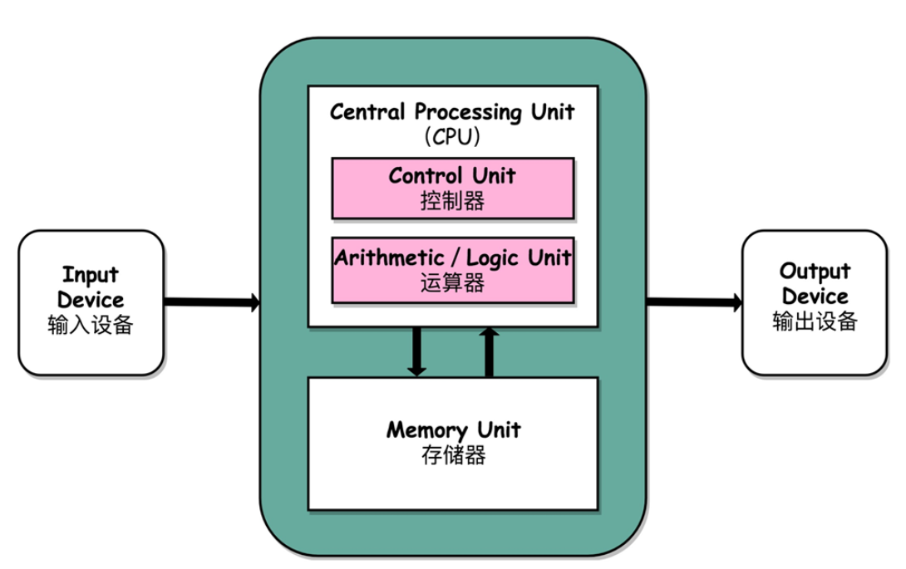

[TOC]

# 计算机组成原理

计算机组成原理是一门基础课程, 隔离软件和硬件. 学习计算机组成原理是学习操作系统、编译原理、计算机网路的基础. 

## 冯-罗伊曼体系结构

### 简介

如何组装一台计算机？

1.  CPU【中央处理器】
2.  内存【程序需要加载到内存中】
3.  显卡【GPU图形处理器】
4.  主板【CPU与内存通信】
    *   芯片组【控制数据传输的流转】
    *   总线【数据传输的高速公路】
5.  输入输出设备
    *   显示器
    *   鼠标、键盘
6.  硬盘

鼠标键盘以及硬盘都是插在主板上面的, 通过南桥芯片组【南面、桥梁】控制和CPU之间的通信. 对应其实也有北桥芯片组, 连接CPU和内存显卡之间的通信, 后来北桥的功能移到了CPU的内部. 

智能手机的组成方式和计算机不太一样, 由于体积原因, 通常是集成到芯片上面, 然后再嵌入到手机主板. 也叫做系统芯片. 

### 体系结构

存储程序计算机, 可编程与存储

1.  计算器, 不可再编程, 程序写死在硬件上面
2.  不可存储, 插线板不能存储程序

祖师爷第一份草案, 描述了心中的计算机组成部分

1.  处理器单元
    *   算术逻辑单元
    *   处理寄存器单元
2.  控制器单元
    *   指令寄存器
    *   程序计数器

3.  存储器

    *   内存

    *   硬盘

4.  输入输出设备【键盘屏幕音频视频网卡】

最后祖师爷抽象出来如下架构. 也就是冯-罗伊曼体系结构, 是计算机基础架构

### 总结

学习计算机组成原理其实就是学习控制器、运算器, 也就是CPU是如何工作的, 以及为什么这么设计, 从基本的电路到上层抽象给到CPU的乃至应用程序的接口. 学习CPU怎么和输入输出设备打交道的. 

## 如何学习？

### 计算机基本组成

1.  硬件设备
    *   CPU
    *   主板
    *   内存
    *   硬盘
    *   鼠标键盘显示器
2.  冯罗伊曼体系【对具体设备的抽象】
    *   运算器
    *   控制器
    *   存储器
    *   输入设备
    *   输出设备
3.  计算机性能【计算机核心指标】
    *   CPU主频
    *   响应时间
    *   吞吐率
4.  计算机功耗【计算机核心指标】
    *   散热
    *   能耗和电力

### 计算机指令和运算

1.  计算机指令【控制器】
    *   机器码
        *   编译-汇编-机器码【高级语言执行】【编译原理】
        *   指令格式和指令跳转
        *   函数调用和程序栈
    *   程序执行
        *   静态链接和ELF格式
        *   程序装载和执行【操作系统】
        *   动态链接
2.  计算机运算【运算器】
    *   二进制编码
        *   整数和补码
        *   字符串和Unicode
        *   浮点数和定点数
    *   数字电路
        *   门电路
        *   加法器
        *   乘法器

### 处理器设计

*   CPU
    *   数据通路【链接运算器和控制器】
        *   处理器时钟【CPU时钟】
        *   触发器和锁存器
    *   面向流水线和设计
    *   控制和数据冒险
    *   分支预测
    *   异常和中断
    *   SIMD和并行计算
*   其他处理器
    *   CISC和RISC
    *   GPU和NUMA架构
    *   FPGA、AISC和TPU
    *   分布式计算
    *   虚拟机和Docker

### 存储器和IO系统

*   存储器和层次结构
    *   局部性原理
    *   SRAM和CPU高速缓存
    *   DRAM和内存
    *   SSD和Flash Card
    *   机械硬盘
*   存储器和IO系统
    *   虚拟内存和内存保护
    *   IO_WAIT: CPU和内存通信
    *   DMA技术提升性能
    *   访问输入输出设备
    *   数据完整性和访问性能
        *   RAID
        *   Erasure Code
        *   ECC内存
        *   Hadoop和分布式存储

### 推荐书籍

1.  计算机是怎样跑起来的
2.  程序是怎样跑起来的
3.  计算机组成与设计: 硬件与软件接口
4.  深入理解计算机系统
5.  编码: 隐匿在计算机软硬件背后的语言
6.  程序员的自我修养: 链接、装载和库