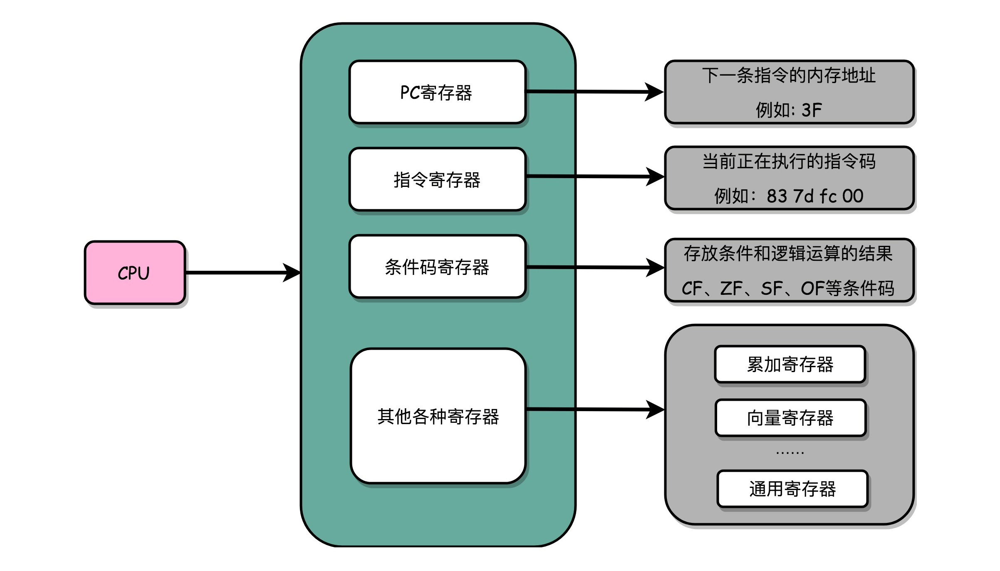

# 计算机指令和运算

## 前奏

1.  硬件角度
    *   大规模集成电路
    *   实现各种处理逻辑
2.  软件角度
    *   CPU执行各种计算机指令
    *   计算机指令，比如机器码
3.  不同CPU
    *   Interl与APM
    *   不同指令

运行高级语言

1.  高级语言代码
2.  编译为汇编语言【给程序员看的机器码】
3.  机器码【CPU执行】

CPU指令

1.  算数【加减乘除】
2.  传输【变量赋值、读取数据】
3.  逻辑【逻辑与或者非】
4.  条件分支
5.  跳转

## CPU执行指令

1.  软件程序员的理解

    写好的代码变成了指令之后、是一条条顺序执行的就可以了

2.  CPU逻辑组成

    *   CPU其实就是一堆寄存器组成
    *   寄存器是由CPU内部多个触发器或者锁存器组成的电路
    *   触发器和锁存器就是两种不同原理的数字电路

3.  寄存器

    N 个触发器或者锁存器，就可以组成一个 N 位（Bit）的寄存器，能够保存 N 位的数据

    

*   PC寄存器【地址寄存器】
*   指令寄存器【存放当前执行的指令】
*   条件码寄存器【存放条件和逻辑运算的结果】

流程

1.  CPU会根据PC寄存器里的地址，从内存里面把需要执行的指令读取到指令寄存器里面直面执行
2.  然后根据指令长度自增、开始顺序读取下一条指令。可以看到一个程序的一条条指令在内存里面是连续保存的。也会一条条顺序加载
3.  而有些特殊指令(J类跳转指令)、会修改寄存器里面的地址
4.  这样下一条要执行的指令就不是从内存里面顺序加载的
5.  事实上、这些跳转指令存在，也就是我们在写程序的时候，使用了 if…else 条件语句和 while/for 循环语句的原因